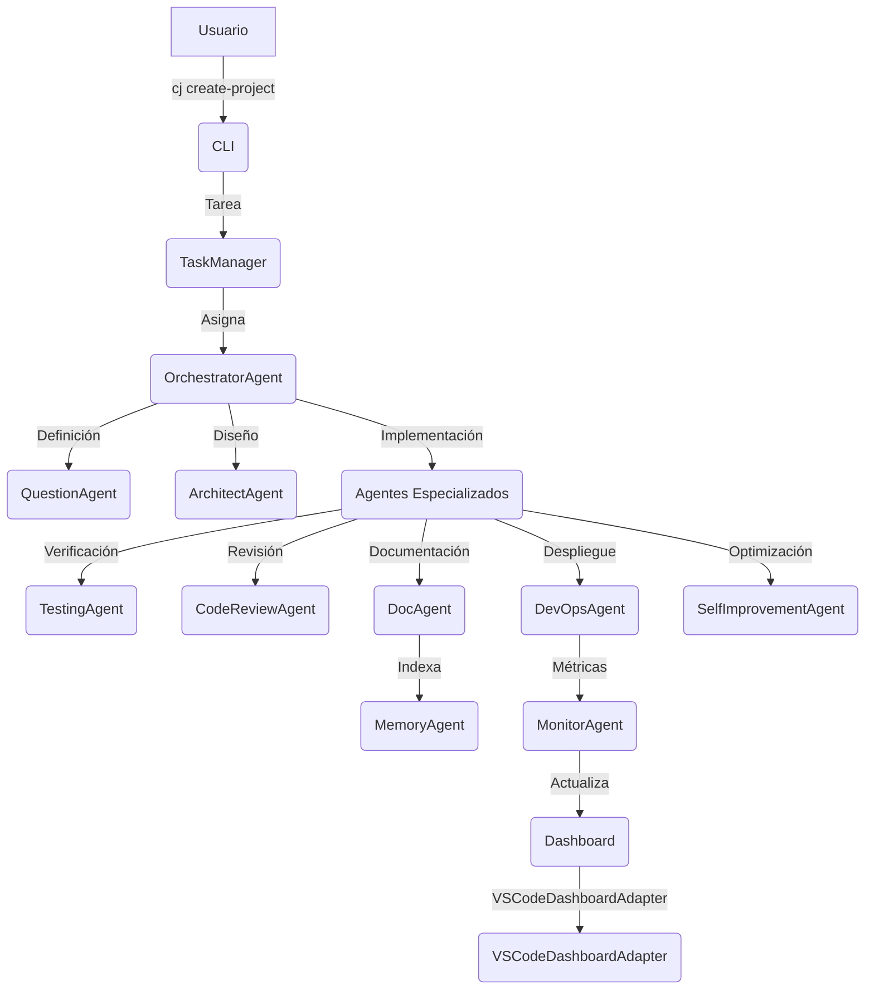
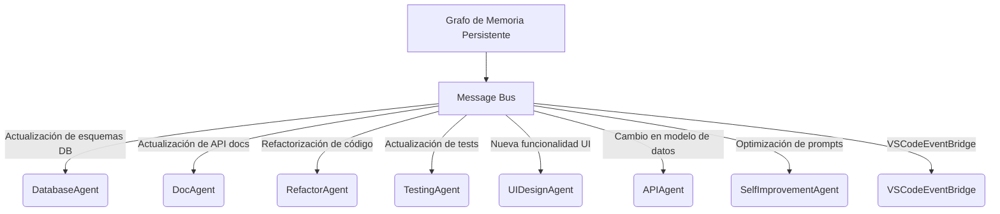
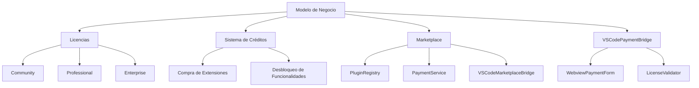

## 🧠 CJ.DevMind: Arquitectura Core (Actualizada)

### Visión General

La arquitectura central de **CJ.DevMind** es el núcleo que soporta la colaboración entre **30 agentes especializados**, la persistencia de datos, la ejecución de tareas, la integración con herramientas externas, y la alineación con el modelo de negocio. Está diseñada para ser modular, segura, escalable y extensible, permitiendo un desarrollo asistido por IA eficiente y robusto. Este documento detalla los componentes principales, sus relaciones, y cómo soportan las funcionalidades clave del sistema, integrando los avances de la **Visión Unificada** para reflejar un sistema revolucionario que rompe barreras, maneja proyectos de cualquier escala y complejidad, y actúa como un equipo completo. Las nuevas capacidades de **autoextensión** (gestionada por el **ExtensionAgent**) y **automejora** (gestionada por el **SelfImprovementAgent**) aseguran un sistema adaptable y optimizado.

#### Características Clave
- **Persistencia de Contexto**: Guardado automático del estado del sistema (tareas, dependencias, métricas, código, documentación, decisiones, tendencias del mercado, preferencias del usuario) con checkpoints periódicos.
- **Ejecución Autónoma Supervisada**: Modo simulación, rollbacks automáticos, y logs transaccionales para operaciones críticas, con niveles de aprobación humana para decisiones clave.
- **Gestión de Dependencias**: Grafo dinámico gestionado por el **OrchestratorAgent**, con resolución de bloqueos y priorización inteligente.
- **Ciclo de Vida de Tareas**: Estados (PENDING, IN_PROGRESS, BLOCKED, REVIEW, COMPLETED, ERROR, CANCELLED) gestionados por el **TaskManager**, con transiciones dinámicas.
- **Dashboard de Supervisión**: Visualización en tiempo real de tareas, métricas de ROI, sistema de créditos, gestión de licencias, y estado del proyecto.
- **Modelo de Negocio Integrado**: Licencias (Community, Professional, Enterprise), sistema de créditos, y marketplace de extensiones, con soporte para pagos (Stripe, PayPal, Crypto).
- **Soporte para Proyectos de Cualquier Escala**: Desde uso personal (por ejemplo, tienda en línea sencilla) hasta proyectos comerciales grandes (por ejemplo, sistema MLM híbrido con tienda internacional) y proyectos innovadores (por ejemplo, plataforma MLM con realidad aumentada).
- **Integración como Extensión de VS Code**: Arquitectura híbrida con un cliente en VS Code y un servidor backend para tareas pesadas, soportando modo offline y seguridad robusta.
- **Autoextensión y Automejora**: El **ExtensionAgent** permite añadir nuevas funcionalidades dinámicamente, mientras que el **SelfImprovementAgent** optimiza el rendimiento y los prompts de los agentes basándose en el historial de ejecución.

---

## 🔄 Estructura de la Arquitectura Core (Visual de Árbol)

La arquitectura central de CJ.DevMind está organizada en una estructura jerárquica, con el **Core** como raíz. A continuación, se presenta la estructura en formato de árbol, combinando los componentes del documento original, las mejoras de la **Visión Unificada**, y las consideraciones para la integración con VS Code. Se han añadido los nuevos agentes (**StyleAgent**, **TestAgent**, **SelfImprovementAgent**, **CodeReviewAgent**) y se ha actualizado la jerarquía para reflejar un total de 32 elementos (30 agentes especializados + `BaseAgent` + `VSCodeAgentBridge`).

```
Core
├── BaseAgent
│   ├── Sistema de Memoria
│   │   ├── VectorDB (Pinecone)
│   │   ├── GraphDB (Neo4j)
│   │   ├── FileSystem
│   │   ├── EmbeddingService
│   │   ├── Base de Datos Vectorial (Local: Faiss, Offline)
│   │   ├── Grafo de Conocimiento
│   │   ├── Historial de Decisiones
│   │   ├── Caché Contextual
│   │   ├── Tendencias del Mercado
│   │   ├── Código
│   │   ├── Documentación
│   │   ├── Componentes
│   │   ├── Dependencias
│   │   ├── Cambios
│   │   ├── Justificaciones
│   │   ├── Información Frecuente
│   │   ├── Preferencias del Usuario
│   │   └── Software Demandado
│   ├── Integración LLM
│   │   ├── OpenAI (GPT-4, GPT-3.5-Turbo)
│   │   ├── Anthropic (Claude)
│   │   ├── Local (Llama, Mistral)
│   │   ├── Azure OpenAI
│   │   └── Local Server (Para VS Code)
│   ├── CLI
│   ├── Logging
│   ├── Gestión de Errores
│   ├── Eventos (EventBus)
│   ├── Memoria Compartida
│   └── VSCodeAdapter
│       ├── CommandRegistry
│       ├── WebviewManager
│       ├── TaskProvider
│       └── StorageManager
├── Flujo de Datos
│   ├── TaskManager
│   ├── Grafo de Dependencias
│   └── Ciclo de Vida de Tareas
│       ├── PENDING
│       ├── IN_PROGRESS
│       ├── REVIEW
│       ├── COMPLETED
│       ├── BLOCKED
│       ├── ERROR
│       └── CANCELLED
├── Comunicación entre Agentes
│   ├── OrchestratorAgent
│   ├── Matriz de Interacciones
│   ├── Sistema de Eventos (EventBus)
│   │   ├── Canales Temáticos
│   │   │   ├── frontend
│   │   │   ├── backend
│   │   │   ├── calidad
│   │   │   ├── infraestructura
│   │   │   ├── documentacion
│   │   │   ├── negocio
│   │   │   └── meta
│   │   ├── Transacciones Atómicas
│   │   └── Mensajes Estructurados
│   │       ├── type
│   │       ├── payload
│   │       └── priority
│   └── VSCodeEventBridge
├── Seguridad
│   ├── Gestión de Credenciales
│   ├── Validación de Entrada
│   ├── Auditoría
│   ├── Niveles de Aprobación
│   ├── Rollbacks Automáticos
│   ├── Logs Transaccionales
│   └── VSCodeSecurityLayer
│       ├── SecretStorage
│       ├── InputSanitizer
│       └── AuditLogger
├── Extensibilidad
│   ├── ExtensionAgent
│   ├── Marketplace
│   │   ├── PluginRegistry
│   │   ├── PluginSandbox
│   │   ├── MarketplaceAPI
│   │   ├── VersionManager
│   │   ├── SecurityScanner
│   │   ├── PaymentService
│   │   └── VSCodeMarketplaceBridge
│   └── Plugins
├── Telemetría y Análisis
│   ├── MonitorAgent
│   ├── AnalyticsAgent
│   ├── Métricas
│   │   ├── Uso de Tokens
│   │   ├── Tiempos
│   │   ├── Tasa de Éxito
│   │   └── Satisfacción
│   └── VSCodeTelemetryAdapter
├── Implementación de Agentes
│   ├── Meta-Nivel
│   │   ├── QuestionAgent
│   │   ├── VisionAgent
│   │   ├── ArchitectAgent
│   │   ├── OrchestratorAgent
│   │   └── ExtensionAgent
│   ├── Frontend
│   │   ├── UIDesignAgent
│   │   ├── LayoutAgent
│   │   ├── ComponentAgent
│   │   ├── FrontendSyncAgent
│   │   └── StyleAgent
│   ├── Backend
│   │   ├── APIAgent
│   │   ├── LogicAgent
│   │   ├── DatabaseAgent
│   │   └── IntegrationAgent
│   ├── Calidad
│   │   ├── TestingAgent
│   │   ├── SecurityAgent
│   │   ├── PerformanceAgent
│   │   ├── RefactorAgent
│   │   ├── TestAgent
│   │   ├── SelfImprovementAgent
│   │   └── CodeReviewAgent
│   ├── Infraestructura
│   │   ├── DevOpsAgent
│   │   ├── MonitorAgent
│   │   ├── DashboardAgent
│   │   └── AnalyticsAgent
│   ├── Documentación
│   │   ├── DocAgent
│   │   └── MemoryAgent
│   ├── Negocio
│   │   ├── BusinessAgent
│   │   ├── MarketAgent
│   │   └── LaunchAgent
│   └── VSCodeAgentBridge
├── Estructura del Proyecto
│   ├── src/
│   │   ├── agents/
│   │   ├── core/
│   │   ├── cli/
│   │   ├── config/
│   │   ├── dashboard/
│   │   ├── marketplace/
│   │   ├── offline/
│   │   └── vscode/
│   │       ├── extension.ts
│   │       ├── command-registry.ts
│   │       ├── webview-manager.ts
│   │       └── storage-manager.ts
│   ├── templates/
│   ├── bin/
│   ├── Base de Datos (cjdevmind.db)
│   ├── Configuraciones
│   └── VSCodeExtension
│       ├── package.json
│       ├── tsconfig.json
│       └── README.md
├── Ciclo de Desarrollo
│   ├── Definición
│   ├── Diseño
│   ├── Planificación
│   ├── Implementación
│   ├── Verificación
│   ├── Despliegue
│   ├── Documentación
│   ├── Memoria
│   ├── Iteración
│   └── VSCodeIntegration
│       ├── CommandExecution
│       ├── FileSystemAccess
│       └── WebviewRendering
├── Integraciones Externas
│   ├── Control de Versiones (GitAdapter)
│   ├── Gestión de Proyectos (JiraAdapter)
│   ├── APIs de Terceros
│   ├── Autenticación
│   ├── Pagos (Stripe, PayPal)
│   └── VSCodeExternalBridge
│       ├── GitExtensionAPI
│       ├── WebSocketClient
│       └── RESTClient
├── Sistema de Procesamiento de Pagos
│   ├── PaymentAdapter
│   │   ├── Stripe
│   │   ├── PayPal
│   │   └── Crypto Payment
│   ├── TransactionMgr
│   ├── InvoiceService
│   ├── Sistema de Créditos
│   ├── Gestión de Licencias
│   │   ├── Community
│   │   ├── Professional
│   │   └── Enterprise
│   ├── Proxy para APIs
│   └── VSCodePaymentBridge
│       ├── WebviewPaymentForm
│       └── LicenseValidator
├── Modo Offline
│   ├── OfflineManager
│   │   ├── OfflineDetector
│   │   ├── ConflictResolver
│   │   └── PriorityQueue
│   ├── LocalStorage
│   ├── SyncService
│   ├── Modelos Locales
│   ├── Dependencias Offline
│   └── VSCodeOfflineAdapter
│       ├── LocalStorageFallback
│       ├── OfflineModelRunner
│       └── SyncQueueManager
└── Dashboard
    ├── Calculadora de ROI
    ├── Visualización de Datos
    ├── Gestión de Licencias
    ├── Marketplace
    ├── Estado de Tareas
    ├── Métricas de Proyecto
    └── VSCodeDashboardAdapter
        ├── WebviewPanel
        ├── TreeViewProvider
        └── RealTimeUpdater
```

---

### Detalle de Componentes de la Arquitectura Core (Actualizado)

#### 1. BaseAgent
- **Responsabilidad**: Clase base que proporciona funcionalidades comunes a todos los agentes, ahora con soporte para integración con VS Code y capacidades de automejora.
- **Componentes**:
  - **Sistema de Memoria**:
    - Gestionado por el **MemoryAgent**.
    - Componentes:
      - **VectorDB (Pinecone)**: Búsqueda semántica en la nube.
      - **GraphDB (Neo4j)**: Relaciones entre entidades.
      - **FileSystem**: Almacenamiento de archivos.
      - **EmbeddingService**: Genera embeddings (OpenAIEmbedding).
      - **Base de Datos Vectorial (Local: Faiss, Offline)**: Para modo offline, usando `faiss` para búsqueda vectorial local.
      - **Grafo de Conocimiento**: Representa relaciones entre componentes (por ejemplo, dependencias entre módulos).
      - **Historial de Decisiones**: Registra decisiones con justificaciones (por ejemplo, "Se eligió React por su soporte para multilenguaje").
      - **Caché Contextual**: Almacena información frecuentemente accedida (por ejemplo, preferencias del usuario).
      - **Tendencias del Mercado**: Almacena datos sobre los 100 software más demandados.
      - **Código**: Código fuente generado por los agentes.
      - **Documentación**: Documentación técnica y de usuario.
      - **Componentes**: Componentes reutilizables (por ejemplo, `BinaryTree`).
      - **Dependencias**: Dependencias entre módulos y agentes.
      - **Cambios**: Historial de cambios en el proyecto.
      - **Justificaciones**: Razones detrás de decisiones.
      - **Información Frecuente**: Datos accedidos frecuentemente.
      - **Preferencias del Usuario**: Estilo, tecnologías preferidas.
      - **Software Demandado**: Lista de software demandado.
    - **Persistencia de Contexto**: Guardado automático tras cambios, checkpoints cada 100 operaciones o 10 minutos.
  - **Integración LLM**:
    - Proveedores soportados:
      - OpenAI (GPT-4, GPT-3.5-Turbo)
      - Anthropic (Claude 2, Claude Instant)
      - Local (Llama, Mistral vía llama.cpp)
      - Azure OpenAI Service
      - **Local Server (Para VS Code)**: Servidor backend local para ejecutar modelos pesados y reducir la carga en VS Code.
    - Usa un Factory Pattern para inicializar proveedores.
  - **CLI**:
    - Interfaz principal para interactuar con el sistema, ahora mapeada a comandos de VS Code.
    - Comandos: `cj question`, `cj simulate`, `cj status`.
  - **Logging**:
    - Sistema unificado de registro para todos los agentes.
  - **Gestión de Errores**:
    - Manejo consistente de excepciones.
  - **Eventos (EventBus)**:
    - Sistema de publicación/suscripción para comunicación entre agentes.
  - **Memoria Compartida**:
    - Acceso unificado al sistema de memoria.
  - **VSCodeAdapter**:
    - **CommandRegistry**: Registra comandos de VS Code (por ejemplo, `cjdevmind.question`).
    - **WebviewManager**: Gestiona webviews para el dashboard y el marketplace.
    - **TaskProvider**: Mapea tareas de CJ.DevMind a tareas de VS Code.
    - **StorageManager**: Gestiona almacenamiento local (`vscode.Memento`, `vscode.workspace.fs`).
- **Implementación**:
  ```typescript
  abstract class BaseAgent {
    protected context: Context;
    protected llmProvider: LLMProvider;
    protected logger: Logger;
    protected memory: MemoryService;
    protected eventBus: EventBus;
    protected vscodeAdapter: VSCodeAdapter;

    constructor(config: AgentConfig) {
      this.context = new Context(config.contextPath);
      this.llmProvider = LLMFactory.create(config.llmProvider);
      this.logger = new Logger(config.name);
      this.memory = MemoryService.getInstance();
      this.eventBus = EventBus.getInstance();
      this.vscodeAdapter = new VSCodeAdapter(config.vscodeContext);
    }

    abstract async execute(input: string): Promise<AgentResult>;

    protected async loadContext(): Promise<void> {
      this.context.load();
    }

    protected async saveContext(): Promise<void> {
      this.context.save();
    }

    protected async callLLM(prompt: string, options?: LLMOptions): Promise<string> {
      return this.llmProvider.call(prompt, options);
    }

    protected log(level: LogLevel, message: string): void {
      this.logger.log(level, message);
    }

    protected publishEvent(event: AgentEvent): void {
      this.eventBus.publish(event.type, event.data);
    }

    protected async queryMemory(query: string): Promise<MemoryResult> {
      return this.memory.query(query);
    }

    protected async saveToMemory(data: any, metadata: any): Promise<void> {
      return this.memory.store(data, metadata);
    }

    protected async registerVSCodeCommand(command: string, callback: (...args: any[]) => any): void {
      this.vscodeAdapter.registerCommand(command, callback);
    }

    protected async showWebview(id: string, content: string): Promise<void> {
      this.vscodeAdapter.showWebview(id, content);
    }

    protected async storeLocalData(key: string, value: any): Promise<void> {
      this.vscodeAdapter.storeLocalData(key, value);
    }
  }
  ```
- **Relaciones**:
  - Proporciona métodos básicos a todos los agentes.
  - Usa el **Sistema de Memoria** para persistencia.
  - La **CLI** interactúa con el **TaskManager** para gestionar tareas.
  - El **VSCodeAdapter** permite la integración con VS Code.
  - El **SelfImprovementAgent** usa el historial de ejecución almacenado en el **Sistema de Memoria** para optimizar prompts y configuraciones.

#### 2. Sistema de Memoria
- **Responsabilidad**: Mantener el contexto entre agentes y sesiones, ahora con soporte para modo offline, almacenamiento en VS Code, y automejora.
- **Componentes**:
  - **VectorDB (Pinecone)**: Búsqueda semántica de datos.
  - **GraphDB (Neo4j)**: Relaciones entre entidades (por ejemplo, dependencias entre tareas).
  - **FileSystem**: Almacenamiento de archivos y documentos.
  - **EmbeddingService**: Genera embeddings para búsqueda semántica.
  - **Base de Datos Vectorial (Local: Faiss, Offline)**: Para modo offline, usando `faiss` para búsqueda vectorial local.
  - **Grafo de Conocimiento**: Representa relaciones entre componentes (por ejemplo, dependencias entre módulos).
  - **Historial de Decisiones**: Registra decisiones con justificaciones.
  - **Caché Contextual**: Almacena información frecuentemente accedida.
  - **Tendencias del Mercado**: Almacena datos sobre los 100 software más demandados.
  - **Código**: Código fuente generado por los agentes.
  - **Documentación**: Documentación técnica y de usuario.
  - **Componentes**: Componentes reutilizables.
  - **Dependencias**: Dependencias entre módulos y agentes.
  - **Cambios**: Historial de cambios en el proyecto.
  - **Justificaciones**: Razones detrás de decisiones.
  - **Información Frecuente**: Datos accedidos frecuentemente.
  - **Preferencias del Usuario**: Estilo, tecnologías preferidas.
  - **Software Demandado**: Lista de software demandado.
  - **Persistencia de Contexto**:
    - Guardado automático tras cambios significativos.
    - Checkpoints periódicos (cada 100 operaciones o 10 minutos).
    - Logs transaccionales para reconstruir el estado.
- **Implementación**:
  ```typescript
  class MemoryService {
    private static instance: MemoryService;
    private vectorDB: VectorDB;
    private graphDB: GraphDB;
    private fileSystem: FileSystem;
    private embeddingService: EmbeddingService;
    private localVectorDB: LocalVectorDB;
    private knowledgeGraph: KnowledgeGraph;
    private decisionHistory: DecisionHistory;
    private contextCache: ContextCache;
    private marketTrends: MarketTrends;
    private codeStore: CodeStore;
    private docStore: DocStore;
    private componentStore: ComponentStore;
    private dependencyStore: DependencyStore;
    private changeLog: ChangeLog;
    private justificationStore: JustificationStore;
    private frequentData: FrequentData;
    private userPreferences: UserPreferences;
    private demandedSoftware: DemandedSoftware;

    private constructor() {
      this.vectorDB = new PineconeDB(config.pinecone);
      this.graphDB = new Neo4jDB(config.neo4j);
      this.fileSystem = new LocalFileSystem(config.storagePath);
      this.embeddingService = new OpenAIEmbedding(config.openai);
      this.localVectorDB = new FaissDB(config.faiss);
      this.knowledgeGraph = new KnowledgeGraph();
      this.decisionHistory = new DecisionHistory();
      this.contextCache = new ContextCache();
      this.marketTrends = new MarketTrends();
      this.codeStore = new CodeStore();
      this.docStore = new DocStore();
      this.componentStore = new ComponentStore();
      this.dependencyStore = new DependencyStore();
      this.changeLog = new ChangeLog();
      this.justificationStore = new JustificationStore();
      this.frequentData = new FrequentData();
      this.userPreferences = new UserPreferences();
      this.demandedSoftware = new DemandedSoftware();
    }

    static getInstance(): MemoryService {
      if (!MemoryService.instance) {
        MemoryService.instance = new MemoryService();
      }
      return MemoryService.instance;
    }

    async query(query: string, offline: boolean = false): Promise<MemoryResult> {
      if (offline) {
        const embedding = await this.embeddingService.generateEmbedding(query);
        return this.localVectorDB.search(embedding);
      }
      const embedding = await this.embeddingService.generateEmbedding(query);
      const results = await this.vectorDB.search(embedding);
      return results;
    }

    async store(data: any, metadata: any, offline: boolean = false): Promise<void> {
      const embedding = await this.embeddingService.generateEmbedding(JSON.stringify(data));
      if (offline) {
        await this.localVectorDB.store(embedding, data, metadata);
      } else {
        await this.vectorDB.store(embedding, data, metadata);
      }
      await this.fileSystem.store(data, metadata);
    }

    async createRelation(from: Entity, to: Entity, type: string): Promise<void> {
      await this.graphDB.createRelation(from, to, type);
      this.knowledgeGraph.addRelation(from, to, type);
    }

    async getRelated(entity: Entity, type?: string): Promise<Entity[]> {
      return this.graphDB.getRelated(entity, type);
    }

    async storeDecision(decision: Decision): Promise<void> {
      await this.decisionHistory.store(decision);
    }

    async storeCode(code: Code): Promise<void> {
      await this.codeStore.store(code);
    }

    async storeUserPreference(key: string, value: any): Promise<void> {
      await this.userPreferences.store(key, value);
    }
  }
  ```
- **Relaciones**:
  - **MemoryAgent** usa este sistema para almacenar contexto.
  - **OrchestratorAgent** consulta el sistema para resolver dependencias.
  - **VSCodeAdapter** usa el sistema de archivos y almacenamiento local para persistencia en VS Code.
  - **SelfImprovementAgent** accede al historial de ejecución para optimizar agentes.

#### 3. Integración LLM
- **Responsabilidad**: Conectar agentes con modelos de lenguaje, optimizado para VS Code y con soporte para automejora.
- **Proveedores Soportados**:
  - OpenAI (GPT-4, GPT-3.5-Turbo)
  - Anthropic (Claude 2, Claude Instant)
  - Local (Llama, Mistral vía llama.cpp)
  - Azure OpenAI Service
  - **Local Server (Para VS Code)**: Servidor backend local para ejecutar modelos pesados.
- **Factory Pattern**:
  ```typescript
  class LLMFactory {
    static create(provider: string, isVSCode: boolean = false): LLMProvider {
      if (isVSCode && provider !== 'local') {
        return new LocalServerProvider(config.localServer);
      }
      switch (provider) {
        case 'openai':
          return new OpenAIProvider(config.openai);
        case 'anthropic':
          return new AnthropicProvider(config.anthropic);
        case 'local':
          return new LocalLLMProvider(config.local);
        case 'azure':
          return new AzureOpenAIProvider(config.azure);
        default:
          throw new Error(`Unsupported LLM provider: ${provider}`);
      }
    }
  }
  ```
- **Relaciones**:
  - **BaseAgent** usa la integración LLM para procesar prompts.
  - **Modo Offline** usa proveedores locales (Llama, Mistral).
  - **VSCodeAdapter** se conecta al servidor local para ejecutar modelos pesados.
  - **SelfImprovementAgent** ajusta dinámicamente los prompts basándose en el historial de ejecución.

#### 4. CLI
- **Responsabilidad**: Interfaz principal para interactuar con CJ.DevMind, ahora mapeada a comandos de VS Code.
- **Comandos Principales**:
  - `cj question`: Inicia el **QuestionAgent**.
  - `cj vision`: Inicia el **VisionAgent**.
  - `cj architect`: Inicia el **ArchitectAgent**.
  - `cj orchestrate`: Inicia el **OrchestratorAgent**.
  - `cj [agent]`: Ejecuta un agente específico.
  - `cj memory`: Interactúa con el **MemoryAgent**.
  - `cj simulate`: Modo simulación para previsualizar acciones.
  - `cj status`: Muestra el estado de las tareas.
  - `cj deploy`: Gestiona despliegues con rollbacks.
- **Implementación**:
  ```typescript
  #!/usr/bin/env node
  import { Command } from 'commander';
  import { AgentFactory } from './agents/agent-factory';
  import { Config } from './config';
  import * as vscode from 'vscode';

  const program = new Command();

  program
    .name('cj')
    .description('CJ.DevMind - Desarrollo asistido por IA')
    .version('1.0.0');

  const agents = [
    'question', 'vision', 'architect', 'orchestrate', 'extension',
    'design', 'layout', 'component', 'sync', 'style',
    'api', 'logic', 'database', 'integration',
    'testing', 'security', 'performance', 'refactor', 'test', 'selfimprovement', 'codereview',
    'devops', 'monitor', 'dashboard', 'analytics',
    'doc', 'memory',
    'business', 'market', 'launch'
  ];

  export function registerCommands(context: vscode.ExtensionContext) {
    agents.forEach(agent => {
      context.subscriptions.push(
        vscode.commands.registerCommand(`cjdevmind.${agent}`, async (input: string) => {
          const config = new Config().load();
          const agentInstance = AgentFactory.create(`${agent}Agent`, {
            ...config,
            vscodeContext: context
          });
          const result = await agentInstance.execute(input || '');
          vscode.window.showInformationMessage(result.output);
        })
      );
    });

    context.subscriptions.push(
      vscode.commands.registerCommand('cjdevmind.simulate', async () => {
        const action = await vscode.window.showInputBox({ prompt: 'Acción a simular' });
        if (action) {
          const config = new Config().load();
          const orchestrator = AgentFactory.create('OrchestratorAgent', config);
          const result = await orchestrator.simulate(action);
          vscode.window.showInformationMessage('Simulación: ' + JSON.stringify(result));
        }
      }),
      vscode.commands.registerCommand('cjdevmind.status', async () => {
        const config = new Config().load();
        const orchestrator = AgentFactory.create('OrchestratorAgent', config);
        const status = await orchestrator.getStatus();
        vscode.window.showInformationMessage('Estado de tareas: ' + JSON.stringify(status, null, 2));
      })
    );
  }
  ```
- **Relaciones**:
  - **CLI** interactúa con el **TaskManager** para gestionar tareas.
  - Usa el **OrchestratorAgent** para coordinar acciones.
  - Mapeada a comandos de VS Code mediante el **VSCodeAdapter**.

#### 5. Flujo de Datos
- **Responsabilidad**: Gestionar el flujo de información entre agentes y tareas.
- **Componentes**:
  - **TaskManager**:
    - Gestiona el ciclo de vida de tareas.
    - Almacena tareas en `cjdevmind.db`.
  - **Grafo de Dependencias**:
    - Mantenido por el **OrchestratorAgent**.
    - Define relaciones (por ejemplo, **FrontendSyncAgent** depende del **APIAgent**).
  - **Ciclo de Vida de Tareas**:
    - Transiciones permitidas:
      - PENDING → IN_PROGRESS, CANCELLED
      - IN_PROGRESS → BLOCKED, REVIEW, ERROR, COMPLETED
      - BLOCKED → IN_PROGRESS, CANCELLED
      - REVIEW → COMPLETED, IN_PROGRESS, CANCELLED
      - ERROR → IN_PROGRESS, CANCELLED
- **Diagrama de Flujo**:
  ```
  Usuario → CLI → OrchestratorAgent → Agentes Especializados → MemoryAgent → Dashboard → Usuario
  ```
- **Relaciones**:
  - **TaskManager** se integra con el **Grafo de Dependencias**.
  - Actualiza el **Dashboard** con el estado de las tareas.
  - Mapeado a tareas de VS Code mediante el **VSCodeAdapter**.

#### 6. Comunicación entre Agentes
- **Responsabilidad**: Facilitar la interacción entre agentes, ahora con soporte para VS Code y un nuevo canal `meta`.
- **Componentes**:
  - **OrchestratorAgent**:
    - Coordina agentes, asigna tareas y resuelve bloqueos.
  - **Matriz de Interacciones**:
    - Define reglas de interacción (por ejemplo, "UIDesignAgent → LayoutAgent").
  - **Sistema de Eventos (EventBus)**:
    - Sistema de publicación/suscripción.
    - **Canales Temáticos**:
      - `frontend`, `backend`, `calidad`, `infraestructura`, `documentacion`, `negocio`, `meta`.
    - **Transacciones Atómicas**: Garantizan consistencia (por ejemplo, actualizar la base de datos y la documentación simultáneamente).
    - **Mensajes Estructurados**:
      - Formato: JSON con campos `type`, `payload`, `priority`.
      - Ejemplo:
        ```json
        {
          "type": "MODEL_CHANGE",
          "payload": {
            "table": "users",
            "schema": "ADD COLUMN points INT"
          },
          "priority": "HIGH"
        }
        ```
  - **VSCodeEventBridge**:
    - Puente para integrar el **EventBus** con los eventos de VS Code (`vscode.EventEmitter`).
- **Implementación del EventBus**:
  ```typescript
  class EventBus {
    private static instance: EventBus;
    private subscribers: Map<string, Function[]>;
    private channels: Map<string, Map<string, Function[]>>;
    private vscodeEmitter: vscode.EventEmitter<any>;

    private constructor(vscodeContext?: vscode.ExtensionContext) {
      this.subscribers = new Map();
      this.channels = new Map([
        ['frontend', new Map()],
        ['backend', new Map()],
        ['calidad', new Map()],
        ['infraestructura', new Map()],
        ['documentacion', new Map()],
        ['negocio', new Map()],
        ['meta', new Map()]
      ]);
      if (vscodeContext) {
        this.vscodeEmitter = new vscode.EventEmitter<any>();
      }
    }

    static getInstance(vscodeContext?: vscode.ExtensionContext): EventBus {
      if (!EventBus.instance) {
        EventBus.instance = new EventBus(vscodeContext);
      }
      return EventBus.instance;
    }

    subscribe(eventType: string, callback: Function, channel?: string): void {
      if (channel && this.channels.has(channel)) {
        const channelSubscribers = this.channels.get(channel)!;
        if (!channelSubscribers.has(eventType)) {
          channelSubscribers.set(eventType, []);
        }
        channelSubscribers.get(eventType)!.push(callback);
      } else {
        if (!this.subscribers.has(eventType)) {
          this.subscribers.set(eventType, []);
        }
        this.subscribers.get(eventType)!.push(callback);
      }
      if (this.vscodeEmitter) {
        this.vscodeEmitter.fire({ eventType, channel });
      }
    }

    publish(eventType: string, data: any, channel?: string): void {
      if (channel && this.channels.has(channel)) {
        const channelSubscribers = this.channels.get(channel)!;
        const callbacks = channelSubscribers.get(eventType) || [];
        callbacks.forEach(callback => callback(data));
      } else {
        const callbacks = this.subscribers.get(eventType) || [];
        callbacks.forEach(callback => callback(data));
      }
      if (this.vscodeEmitter) {
        this.vscodeEmitter.fire({ eventType, data, channel });
      }
    }

    unsubscribe(eventType: string, callback: Function, channel?: string): void {
      if (channel && this.channels.has(channel)) {
        const channelSubscribers = this.channels.get(channel)!;
        const callbacks = channelSubscribers.get(eventType);
        if (callbacks) {
          channelSubscribers.set(eventType, callbacks.filter(cb => cb !== callback));
        }
      } else {
        const callbacks = this.subscribers.get(eventType);
        if (callbacks) {
          this.subscribers.set(eventType, callbacks.filter(cb => cb !== callback));
        }
      }
    }
  }
  ```
- **Relaciones**:
  - **OrchestratorAgent** usa la **Matriz de Interacciones**.
  - **EventBus** facilita la comunicación entre agentes.
  - **VSCodeEventBridge** integra eventos con VS Code.
  - El canal `meta` es usado por agentes como **SelfImprovementAgent** para eventos de optimización.

#### 7. Seguridad
- **Responsabilidad**: Garantizar operaciones seguras, ahora con soporte para VS Code y revisión de código.
- **Componentes**:
  - **Gestión de Credenciales**:
    - Almacenamiento seguro de claves API.
    - Rotación automática de credenciales.
    - Aislamiento de entornos.
  - **Validación de Entrada**:
    - Sanitización de entradas.
    - Validación de esquemas.
    - Prevención de inyección de prompts.
  - **Auditoría**:
    - Registro detallado de operaciones.
    - Trazabilidad de decisiones.
    - Alertas para actividades sospechosas.
  - **Niveles de Aprobación**:
    - Tareas críticas (despliegues, integraciones) requieren aprobación humana (REVIEW).
  - **Rollbacks Automáticos**:
    - Puntos de restauración antes de operaciones críticas.
  - **Logs Transaccionales**:
    - Registra transacciones para reconstruir el estado.
  - **VSCodeSecurityLayer**:
    - **SecretStorage**: Usa `vscode.SecretStorage` para almacenar claves API.
    - **InputSanitizer**: Sanitiza entradas del usuario.
    - **AuditLogger**: Registra logs en el sistema de archivos de VS Code.
- **Relaciones**:
  - **SecurityAgent** implementa estas medidas.
  - **OrchestratorAgent** usa logs y niveles de aprobación.
  - **VSCodeSecurityLayer** asegura la integración con VS Code.
  - **CodeReviewAgent** revisa el código generado para detectar vulnerabilidades.

#### 8. Extensibilidad
- **Responsabilidad**: Permitir añadir nuevas funcionalidades, ahora con soporte para VS Code y autoextensión.
- **Componentes**:
  - **ExtensionAgent**:
    - Gestiona extensiones del marketplace y permite autoextensión del sistema.
  - **Marketplace**:
    - **PluginRegistry**: Registro de plugins disponibles.
    - **PluginSandbox**: Entorno seguro para ejecutar plugins.
    - **MarketplaceAPI**: API para listar, instalar y publicar plugins.
    - **VersionManager**: Gestiona versiones de plugins.
    - **SecurityScanner**: Escanea plugins por vulnerabilidades.
    - **PaymentService**: Procesa pagos para plugins.
    - **VSCodeMarketplaceBridge**: Integra con el marketplace oficial de VS Code.
  - **Plugins**:
    - Interfaz para plugins personalizados.
- **Implementación del Marketplace**:
  ```typescript
  class MarketplaceAPI {
    private pluginRegistry: PluginRegistry;
    private reviewService: ReviewService;
    private paymentService: PaymentService;
    private vscodeBridge: VSCodeMarketplaceBridge;

    constructor(config: MarketplaceConfig) {
      this.pluginRegistry = new PluginRegistry(config.registryPath);
      this.reviewService = new ReviewService(config.reviewConfig);
      this.paymentService = new PaymentService(config.paymentConfig);
      this.vscodeBridge = new VSCodeMarketplaceBridge();
    }

    async listPlugins(filters?: PluginFilters): Promise<Plugin[]> {
      const plugins = await this.pluginRegistry.getPlugins(filters);
      const vscodePlugins = await this.vscodeBridge.listVSCodePlugins(filters);
      return [...plugins, ...vscodePlugins];
    }

    async installPlugin(pluginId: string, version?: string): Promise<InstallResult> {
      const plugin = await this.pluginRegistry.getPlugin(pluginId, version);
      const securityResult = await this.securityScanner.scan(plugin);
      if (!securityResult.isSafe) {
        throw new Error('Plugin failed security scan');
      }
      if (plugin.isVSCodeExtension) {
        return this.vscodeBridge.installVSCodePlugin(pluginId, version);
      }
      return { success: true, pluginId, version: plugin.version };
    }

    async publishPlugin(plugin: PluginSubmission): Promise<PublishResult> {
      const securityResult = await this.securityScanner.scan(plugin);
      if (!securityResult.isSafe) {
        throw new Error('Plugin failed security scan');
      }
      const paymentResult = await this.paymentService.processSubmissionFee(plugin);
      if (!paymentResult.success) {
        throw new Error('Payment failed');
      }
      if (plugin.isVSCodeExtension) {
        return this.vscodeBridge.publishVSCodePlugin(plugin);
      }
      return { 
        success: true, 
        pluginId: generateId(), 
        reviewEstimate: '5 días hábiles' 
      };
    }
  }
  ```
- **Implementación de Plugins**:
  ```typescript
  interface Plugin {
    name: string;
    version: string;
    isVSCodeExtension: boolean;
    initialize(system: CJDevMind): void;
    shutdown(): void;
  }

  class CJDevMind {
    private plugins: Map<string, Plugin>;

    registerPlugin(plugin: Plugin): void {
      this.plugins.set(plugin.name, plugin);
      plugin.initialize(this);
    }

    unregisterPlugin(pluginName: string): void {
      const plugin = this.plugins.get(pluginName);
      if (plugin) {
        plugin.shutdown();
        this.plugins.delete(pluginName);
      }
    }
  }
  ```
- **Relaciones**:
  - **ExtensionAgent** usa la **MarketplaceAPI** para autoextensión.
  - **Marketplace** se integra con el **Sistema de Procesamiento de Pagos**.
  - **VSCodeMarketplaceBridge** permite integración con el marketplace oficial de VS Code.

#### 9. Telemetría y Análisis
- **Responsabilidad**: Recolectar y analizar métricas, ahora con soporte para VS Code y automejora.
- **Componentes**:
  - **MonitorAgent**:
    - Registra métricas (uso de CPU, tiempos de respuesta).
  - **AnalyticsAgent**:
    - Calcula métricas de ROI y adopción.
  - **Métricas Clave**:
    - Uso de Tokens: Consumo por agente.
    - Tiempos de Respuesta: Latencia de agentes.
    - Tasa de Éxito: Operaciones exitosas.
    - Satisfacción: Feedback del usuario.
  - **VSCodeTelemetryAdapter**:
    - Integra métricas con el sistema de telemetría de VS Code.
- **Implementación**:
  ```typescript
  class TelemetryService {
    private static instance: TelemetryService;
    private metrics: Map<string, Metric>;
    private vscodeTelemetry: VSCodeTelemetry;

    private constructor(vscodeContext?: vscode.ExtensionContext) {
      this.metrics = new Map();
      if (vscodeContext) {
        this.vscodeTelemetry = new VSCodeTelemetry(vscodeContext);
      }
    }

    static getInstance(vscodeContext?: vscode.ExtensionContext): TelemetryService {
      if (!TelemetryService.instance) {
        TelemetryService.instance = new TelemetryService(vscodeContext);
      }
      return TelemetryService.instance;
    }

    recordMetric(name: string, value: number, tags?: Record<string, string>): void {
      const metric = { name, value, tags, timestamp: Date.now() };
      this.metrics.set(`${name}_${Date.now()}`, metric);
      if (this.vscodeTelemetry) {
        this.vscodeTelemetry.logUsage(name, value, tags);
      }
    }

    getMetrics(filter?: MetricFilter): Metric[] {
      let metrics = Array.from(this.metrics.values());
      if (filter) {
        metrics = metrics.filter(m => 
          (!filter.name || m.name === filter.name) &&
          (!filter.tags || Object.entries(filter.tags).every(([k, v]) => m.tags[k] === v))
        );
      }
      return metrics;
    }

    exportMetrics(format: ExportFormat): string {
      const metrics = this.getMetrics();
      if (format === 'json') {
        return JSON.stringify(metrics, null, 2);
      }
      return metrics.map(m => `${m.name}: ${m.value}`).join('\n');
    }
  }
  ```
- **Relaciones**:
  - **MonitorAgent** y **AnalyticsAgent** usan **TelemetryService**.
  - Actualizan el **Dashboard** con métricas.
  - **VSCodeTelemetryAdapter** integra con VS Code.
  - **SelfImprovementAgent** usa métricas para optimizar el rendimiento.

#### 10. Implementación de Agentes
- **Responsabilidad**: Define cómo se implementan los agentes, ahora con soporte para VS Code y nuevos agentes.
- **Componentes**:
  - **Meta-Nivel**:
    - **QuestionAgent**: Recopila requisitos mediante un cuestionario detallado.
    - **VisionAgent**: Traduce ideas en especificaciones técnicas.
    - **ArchitectAgent**: Diseña la arquitectura global.
    - **OrchestratorAgent**: Coordina agentes y tareas.
    - **ExtensionAgent**: Gestiona extensiones y autoextensión.
  - **Frontend**:
    - **UIDesignAgent**: Crea sistemas de diseño y UI.
    - **LayoutAgent**: Estructura la navegación.
    - **ComponentAgent**: Desarrolla componentes reutilizables con documentación.
    - **FrontendSyncAgent**: Integra componentes y gestiona el estado.
    - **StyleAgent**: Genera estilos (por ejemplo, CSS, Tailwind).
  - **Backend**:
    - **APIAgent**: Diseña e implementa APIs.
    - **LogicAgent**: Desarrolla lógica de negocio.
    - **DatabaseAgent**: Gestiona modelos de datos.
    - **IntegrationAgent**: Conecta con servicios externos.
  - **Calidad**:
    - **TestingAgent**: Crea y ejecuta pruebas unitarias e integración.
    - **SecurityAgent**: Implementa medidas de seguridad.
    - **PerformanceAgent**: Optimiza rendimiento.
    - **RefactorAgent**: Mejora la calidad del código.
    - **TestAgent**: Genera pruebas de accesibilidad y usabilidad.
    - **SelfImprovementAgent**: Optimiza agentes basándose en el historial de ejecución.
    - **CodeReviewAgent**: Revisa el código generado para detectar vulnerabilidades y mejorar calidad.
  - **Infraestructura**:
    - **DevOpsAgent**: Configura entornos y CI/CD.
    - **MonitorAgent**: Implementa observabilidad.
    - **DashboardAgent**: Crea interfaces de visualización.
    - **AnalyticsAgent**: Analiza métricas.
  - **Documentación**:
    - **DocAgent**: Genera documentación.
    - **MemoryAgent**: Mantiene el conocimiento global.
  - **Negocio**:
    - **BusinessAgent**: Evalúa viabilidad económica.
    - **MarketAgent**: Analiza tendencias del mercado.
    - **LaunchAgent**: Planifica el lanzamiento.
  - **VSCodeAgentBridge**:
    - Puente para ejecutar agentes dentro de VS Code.
- **Ejemplo: SelfImprovementAgent**:
  ```typescript
  class SelfImprovementAgent extends BaseAgent {
    constructor(config: AgentConfig) {
      super(config);
    }

    async execute(input: string): Promise<AgentResult> {
      const history = await this.queryMemory('execution_history');
      const optimizationSuggestions = await this.analyzeHistory(history);
      await this.applyOptimizations(optimizationSuggestions);
      return {
        output: 'Optimizations applied successfully',
        metadata: { suggestions: optimizationSuggestions }
      };
    }

    private async analyzeHistory(history: any[]): Promise<OptimizationSuggestions> {
      const prompt = `Analyze the following execution history and suggest optimizations:\n${JSON.stringify(history)}`;
      const response = await this.callLLM(prompt);
      return JSON.parse(response);
    }

    private async applyOptimizations(suggestions: OptimizationSuggestions): Promise<void> {
      for (const suggestion of suggestions) {
        if (suggestion.type === 'prompt_update') {
          await this.updatePrompt(suggestion.agent, suggestion.newPrompt);
        }
      }
    }
  }
  ```
- **Relaciones**:
  - Todos heredan del **BaseAgent**.
  - **OrchestratorAgent** coordina su implementación.
  - **VSCodeAgentBridge** permite ejecutar agentes en VS Code.
  - **SelfImprovementAgent** optimiza otros agentes.

#### 11. Estructura del Proyecto
- **Responsabilidad**: Define la organización del sistema en disco, ahora con soporte para VS Code y nuevos agentes.
- **Estructura**:
  ```
  cj-devmind/
  ├── src/
  │   ├── agents/
  │   │   ├── base-agent.ts
  │   │   ├── meta/
  │   │   │   ├── question-agent.ts
  │   │   │   ├── vision-agent.ts
  │   │   │   ├── architect-agent.ts
  │   │   │   ├── orchestrator-agent.ts
  │   │   │   └── extension-agent.ts
  │   │   ├── frontend/
  │   │   │   ├── ui-design-agent.ts
  │   │   │   ├── layout-agent.ts
  │   │   │   ├── component-agent.ts
  │   │   │   ├── frontend-sync-agent.ts
  │   │   │   └── style-agent.ts
  │   │   ├── backend/
  │   │   │   ├── api-agent.ts
  │   │   │   ├── logic-agent.ts
  │   │   │   ├── database-agent.ts
  │   │   │   └── integration-agent.ts
  │   │   ├── quality/
  │   │   │   ├── testing-agent.ts
  │   │   │   ├── security-agent.ts
  │   │   │   ├── performance-agent.ts
  │   │   │   ├── refactor-agent.ts
  │   │   │   ├── test-agent.ts
  │   │   │   ├── selfimprovement-agent.ts
  │   │   │   └── codereview-agent.ts
  │   │   ├── infrastructure/
  │   │   │   ├── devops-agent.ts
  │   │   │   ├── monitor-agent.ts
  │   │   │   ├── dashboard-agent.ts
  │   │   │   └── analytics-agent.ts
  │   │   ├── documentation/
  │   │   │   ├── doc-agent.ts
  │   │   │   └── memory-agent.ts
  │   │   ├── negocio/
  │   │   │   ├── business-agent.ts
  │   │   │   ├── market-agent.ts
  │   │   │   └── launch-agent.ts
  │   │   └── others/
  │   │       └── extension-agent.ts
  │   ├── core/
  │   │   ├── context.ts
  │   │   ├── llm/
  │   │   │   ├── llm-provider.ts
  │   │   │   ├── openai-provider.ts
  │   │   │   ├── anthropic-provider.ts
  │   │   │   ├── local-provider.ts
  │   │   │   ├── azure-provider.ts
  │   │   │   └── local-server-provider.ts
  │   │   ├── memory/
  │   │   │   ├── memory-service.ts
  │   │   │   ├── vector-db.ts
  │   │   │   ├── graph-db.ts
  │   │   │   ├── file-system.ts
  │   │   │   ├── embedding-service.ts
  │   │   │   ├── local-vector-db.ts
  │   │   │   ├── knowledge-graph.ts
  │   │   │   ├── decision-history.ts
  │   │   │   ├── context-cache.ts
  │   │   │   ├── market-trends.ts
  │   │   │   ├── code-store.ts
  │   │   │   ├── doc-store.ts
  │   │   │   ├── component-store.ts
  │   │   │   ├── dependency-store.ts
  │   │   │   ├── change-log.ts
  │   │   │   ├── justification-store.ts
  │   │   │   ├── frequent-data.ts
  │   │   │   ├── user-preferences.ts
  │   │   │   └── demanded-software.ts
  │   │   ├── events/
  │   │   │   ├── event-bus.ts
  │   │   │   ├── agent-events.ts
  │   │   │   └── vscode-event-bridge.ts
  │   │   └── telemetry/
  │   │       ├── telemetry-service.ts
  │   │       ├── metrics.ts
  │   │       └── vscode-telemetry-adapter.ts
  │   ├── cli/
  │   │   ├── index.ts
  │   │   ├── commands/
  │   │   │   └── agent-commands.ts
  │   │   └── utils/
  │   │       ├── output-formatter.ts
  │   │       └── input-parser.ts
  │   ├── config/
  │   │   ├── config.ts
  │   │   └── default-config.ts
  │   ├── dashboard/
  │   │   ├── dashboard-provider.ts
  │   │   ├── roi-calculator.ts
  │   │   ├── data-visualizer.ts
  │   │   └── license-manager.ts
  │   ├── marketplace/
  │   │   ├── marketplace-api.ts
  │   │   ├── plugin-registry.ts
  │   │   ├── plugin-sandbox.ts
  │   │   ├── version-manager.ts
  │   │   ├── security-scanner.ts
  │   │   └── vscode-marketplace-bridge.ts
  │   ├── offline/
  │   │   ├── offline-manager.ts
  │   │   ├── offline-detector.ts
  │   │   ├── conflict-resolver.ts
  │   │   ├── priority-queue.ts
  │   │   └── sync-service.ts
  │   └── vscode/
  │       ├── extension.ts
  │       ├── command-registry.ts
  │       ├── webview-manager.ts
  │       └── storage-manager.ts
  ├── templates/
  │   ├── prompts/
  │   │   └── [agent-name].prompt.txt
  │   ├── architecture/
  │   │   └── patterns/
  │   └── folder-structures/
  ├── bin/
  │   └── cj.js
  ├── package.json
  ├── tsconfig.json
  ├── cjdevmind.db
  ├── README.md
  └── VSCodeExtension/
      ├── package.json
      ├── tsconfig.json
      └── README.md
  ```
- **Base de Datos**:
  - `cjdevmind.db`: Almacena tareas, estados y contexto.
- **Relaciones**:
  - **Base de Datos** es gestionada por el **TaskManager** y **MemoryAgent**.
  - Carpetas son creadas por el **ArchitectAgent**.
  - **VSCodeExtension** contiene la configuración para la extensión de VS Code.

#### 12. Ciclo de Desarrollo
- **Responsabilidad**: Definir el flujo de desarrollo, ahora con soporte para VS Code y automejora.
- **Etapas**:
  - **Definición**: **QuestionAgent** y **VisionAgent** definen el proyecto.
  - **Diseño**: **ArchitectAgent** diseña la estructura.
  - **Planificación**: **OrchestratorAgent** crea el plan.
  - **Implementación**: Agentes especializados implementan.
  - **Verificación**: Agentes de calidad verifican.
  - **Despliegue**: Agentes de infraestructura despliegan.
  - **Documentación**: **DocAgent** genera documentación.
  - **Memoria**: **MemoryAgent** indexa el proyecto.
  - **Iteración**: Ciclo se repite.
  - **VSCodeIntegration**:
    - **CommandExecution**: Ejecuta comandos de VS Code.
    - **FileSystemAccess**: Usa `vscode.workspace.fs` para acceder al sistema de archivos.
    - **WebviewRendering**: Renderiza interfaces en webviews.
- **Relaciones**:
  - **OrchestratorAgent** coordina el ciclo.
  - **RefactorAgent** colabora con el **TestingAgent**.
  - **VSCodeIntegration** permite ejecutar el ciclo en VS Code.
  - **SelfImprovementAgent** optimiza el ciclo basándose en iteraciones previas.

#### 13. Integraciones Externas
- **Responsabilidad**: Conectar con herramientas externas, ahora con soporte para VS Code.
- **Componentes**:
  - **Control de Versiones (GitAdapter)**:
    ```typescript
    class GitAdapter {
      private repoPath: string;
      private vscodeGit: any;

      constructor(repoPath: string, vscodeContext?: vscode.ExtensionContext) {
        this.repoPath = repoPath;
        if (vscodeContext) {
          this.vscodeGit = vscode.extensions.getExtension('vscode.git')?.exports;
        }
      }

      async commit(message: string): Promise<void> {
        if (this.vscodeGit) {
          await this.vscodeGit.commit(message);
        } else {
          await exec(`git -C ${this.repoPath} commit -m "${message}"`);
        }
      }

      async checkout(branch: string): Promise<void> {
        if (this.vscodeGit) {
          await this.vscodeGit.checkout(branch);
        } else {
          await exec(`git -C ${this.repoPath} checkout ${branch}`);
        }
      }

      async push(): Promise<void> {
        if (this.vscodeGit) {
          await this.vscodeGit.push();
        } else {
          await exec(`git -C ${this.repoPath} push`);
        }
      }

      async pull(): Promise<void> {
        if (this.vscodeGit) {
          await this.vscodeGit.pull();
        } else {
          await exec(`git -C ${this.repoPath} pull`);
        }
      }

      async getDiff(from: string, to: string): Promise<string> {
        if (this.vscodeGit) {
          return await this.vscodeGit.getDiff(from, to);
        }
        return await exec(`git -C ${this.repoPath} diff ${from} ${to}`);
      }
    }
    ```
  - **Gestión de Proyectos (JiraAdapter)**:
    ```typescript
    class JiraAdapter {
      private apiKey: string;
      private domain: string;

      constructor(config: JiraConfig) {
        this.apiKey = config.apiKey;
        this.domain = config.domain;
      }

      async createIssue(issue: JiraIssue): Promise<string> {
        const response = await fetch(`${this.domain}/rest/api/3/issue`, {
          method: 'POST',
          headers: { 'Authorization': `Bearer ${this.apiKey}` },
          body: JSON.stringify(issue)
        });
        return (await response.json()).id;
      }

      async updateIssue(id: string, update: Partial<JiraIssue>): Promise<void> {
        await fetch(`${this.domain}/rest/api/3/issue/${id}`, {
          method: 'PUT',
          headers: { 'Authorization': `Bearer ${this.apiKey}` },
          body: JSON.stringify(update)
        });
      }

      async getIssue(id: string): Promise<JiraIssue> {
        const response = await fetch(`${this.domain}/rest/api/3/issue/${id}`, {
          headers: { 'Authorization': `Bearer ${this.apiKey}` }
        });
        return response.json();
      }
    }
    ```
  - **APIs de Terceros**: Gestionadas por el **IntegrationAgent**.
  - **Autenticación**: OAuth, JWT (SecurityAgent).
  - **Pagos**: Stripe, PayPal (IntegrationAgent).
  - **VSCodeExternalBridge**:
    - **GitExtensionAPI**: Usa la API de Git de VS Code.
    - **WebSocketClient**: Conecta con servidores externos.
    - **RESTClient**: Realiza solicitudes HTTP.
- **Relaciones**:
  - **IntegrationAgent** usa adaptadores.
  - **Pagos** se conectan al **Sistema de Procesamiento de Pagos**.
  - **VSCodeExternalBridge** permite integraciones en VS Code.

#### 14. Sistema de Procesamiento de Pagos
- **Responsabilidad**: Gestionar transacciones y licencias, ahora con soporte para VS Code.
- **Componentes**:
  - **PaymentAdapter**:
    - Proveedores: Stripe, PayPal, Crypto Payment (BinancePay, Blockonomics).
  - **TransactionMgr**: Gestiona transacciones.
  - **InvoiceService**: Genera facturas.
  - **Sistema de Créditos**: Usados para comprar extensiones.
  - **Gestión de Licencias**:
    - **Community**: Funcionalidad básica, acceso limitado al marketplace.
    - **Professional**: Más agentes, acceso completo al marketplace.
    - **Enterprise**: Funcionalidad completa, soporte prioritario.
  - **Proxy para APIs**: Controla acceso según licencia.
  - **VSCodePaymentBridge**:
    - **WebviewPaymentForm**: Formulario de pago en un webview.
    - **LicenseValidator**: Verifica la licencia del usuario.
- **Arquitectura de Pagos**:
  ```
  IntegrationAgent
  ├── PaymentAdapter
  │   ├── Stripe
  │   ├── PayPal
  │   └── Crypto Payment
  ├── TransactionMgr
  ├── InvoiceService
  ├── Sistema de Créditos
  ├── Gestión de Licencias
  │   ├── Community
  │   ├── Professional
  │   └── Enterprise
  ├── Proxy para APIs
  └── VSCodePaymentBridge
      ├── WebviewPaymentForm
      └── LicenseValidator
  ```
- **Implementación**:
  ```typescript
  interface PaymentProvider {
    processPayment(amount: number, currency: string, metadata: any): Promise<PaymentResult>;
    refundPayment(paymentId: string, amount?: number): Promise<RefundResult>;
    getPaymentStatus(paymentId: string): Promise<PaymentStatus>;
  }

  class PaymentAdapter {
    private providers: Map<string, PaymentProvider>;
    private defaultProvider: string;

    constructor(config: PaymentConfig) {
      this.providers = new Map();
      this.defaultProvider = config.defaultProvider;
      
      if (config.stripe) {
        this.providers.set('stripe', new StripeProvider(config.stripe));
      }
      if (config.paypal) {
        this.providers.set('paypal', new PayPalProvider(config.paypal));
      }
      if (config.binancePay) {
        this.providers.set('binancePay', new BinancePayProvider(config.binancePay));
      }
    }

    async processPayment(amount: number, currency: string, metadata: any, provider?: string): Promise<PaymentResult> {
      const selectedProvider = provider || this.defaultProvider;
      const paymentProvider = this.providers.get(selectedProvider);
      if (!paymentProvider) {
        throw new Error(`Payment provider ${selectedProvider} not configured`);
      }
      return paymentProvider.processPayment(amount, currency, metadata);
    }
  }
  ```
- **Relaciones**:
  - **PaymentAdapter** se integra con el **Marketplace**.
  - **Sistema de Créditos** y **Gestión de Licencias** actualizan el **Dashboard**.
  - **VSCodePaymentBridge** permite pagos en VS Code.

#### 15. Modo Offline
- **Responsabilidad**: Permitir operaciones sin conexión, ahora con soporte para VS Code.
- **Componentes**:
  - **OfflineManager**:
    - **OfflineDetector**: Detecta estado de conexión.
    - **ConflictResolver**: Resuelve conflictos al sincronizar.
    - **PriorityQueue**: Cola de sincronización.
  - **LocalStorage**: Almacenamiento local.
  - **SyncService**: Sincroniza datos al reconectar.
  - **Modelos Locales**: Llama, Mistral.
  - **Dependencias Offline**: Preinstaladas.
  - **VSCodeOfflineAdapter**:
    - **LocalStorageFallback**: Usa `vscode.Memento` y `vscode.workspace.fs`.
    - **OfflineModelRunner**: Ejecuta modelos locales.
    - **SyncQueueManager**: Gestiona la cola de sincronización.
- **Arquitectura Offline**:
  ```
  DevOpsAgent
  ├── OfflineManager
  │   ├── OfflineDetector
  │   ├── ConflictResolver
  │   └── PriorityQueue
  ├── LocalStorage
  ├── SyncService
  ├── Modelos Locales
  ├── Dependencias Offline
  └── VSCodeOfflineAdapter
      ├── LocalStorageFallback
      ├── OfflineModelRunner
      └── SyncQueueManager
  ```
- **Implementación**:
  ```typescript
  class OfflineManager {
    private isOffline: boolean = false;
    private syncQueue: PriorityQueue<SyncOperation>;
    private localStorage: LocalStorage;
    private syncService: SyncService;
    private offlineDetector: OfflineDetector;
    private vscodeStorage: VSCodeStorage;

    constructor(config: OfflineConfig, vscodeContext?: vscode.ExtensionContext) {
      this.localStorage = new LocalStorage(config.storagePath);
      this.syncService = new SyncService(config.syncConfig);
      this.syncQueue = new PriorityQueue<SyncOperation>();
      this.offlineDetector = new OfflineDetector({
        pingInterval: config.pingInterval || 30000,
        pingEndpoint: config.pingEndpoint || 'https://api.cjdevmind.com/ping',
        onStatusChange: this.handleConnectivityChange.bind(this)
      });
      if (vscodeContext) {
        this.vscodeStorage = new VSCodeStorage(vscodeContext);
      }
    }

    private handleConnectivityChange(isOnline: boolean): void {
      const wasOffline = this.isOffline;
      this.isOffline = !isOnline;
      if (wasOffline && isOnline) {
        this.syncService.synchronize(this.syncQueue);
      }
    }
  }
  ```
- **Relaciones**:
  - **Modo Offline** usa el **Sistema de Memoria**.
  - No afecta al **Marketplace** (requiere conexión).
  - **VSCodeOfflineAdapter** permite operaciones offline en VS Code.

#### 16. Dashboard
- **Responsabilidad**: Interfaz de supervisión, ahora con soporte para VS Code.
- **Componentes**:
  - **Calculadora de ROI**: Calcula retorno de inversión.
  - **Visualización de Datos**: Estados de tareas y métricas.
  - **Gestión de Licencias**: Muestra plan y créditos.
  - **Marketplace**: Interfaz para comprar extensiones.
  - **Estado de Tareas**: Muestra el ciclo de vida de tareas.
  - **Métricas de Proyecto**: Muestra métricas específicas del proyecto.
  - **VSCodeDashboardAdapter**:
    - **WebviewPanel**: Renderiza el dashboard en un webview.
    - **TreeViewProvider**: Muestra tareas en una vista de árbol.
    - **RealTimeUpdater**: Actualiza datos en tiempo real.
- **Implementación**:
  ```typescript
  class DashboardProvider implements vscode.WebviewViewProvider {
    constructor(private context: vscode.ExtensionContext) {}

    resolveWebviewView(webviewView: vscode.WebviewView) {
      webviewView.webview.options = { enableScripts: true };
      webviewView.webview.html = `
        <!DOCTYPE html>
        <html>
        <head>
          <title>CJ.DevMind Dashboard</title>
        </head>
        <body>
          <h1>CJ.DevMind Dashboard</h1>
          <div id="tasks">Loading tasks...</div>
          <div id="metrics">Loading metrics...</div>
          <div id="license">Loading license...</div>
          <script>
            const vscode = acquireVsCodeApi();
            window.addEventListener('message', event => {
              const message = event.data;
              if (message.type === 'updateTasks') {
                document.getElementById('tasks').innerText = JSON.stringify(message.data, null, 2);
              }
              if (message.type === 'updateMetrics') {
                document.getElementById('metrics').innerText = JSON.stringify(message.data, null, 2);
              }
              if (message.type === 'updateLicense') {
                document.getElementById('license').innerText = JSON.stringify(message.data, null, 2);
              }
            });
          </script>
        </body>
        </html>
      `;
    }
  }
  ```
- **Relaciones**:
  - **DashboardAgent** usa datos del **OrchestratorAgent**, **MonitorAgent**, y **AnalyticsAgent**.
  - Integra el **Sistema de Procesamiento de Pagos**.
  - **VSCodeDashboardAdapter** renderiza el dashboard en VS Code.

---

## 📊 Diagramas de Relación (Actualizados)

### Diagrama 1: Arquitectura General
Este diagrama muestra cómo los componentes del Core interactúan, ahora con soporte para VS Code y nuevos agentes.

```mermaid
graph TD
    A[Core] --> B(BaseAgent)
    A --> C(Flujo de Datos)
    A --> D(Comunicación entre Agentes)
    A --> E(Seguridad)
    A --> F(Extensibilidad)
    A --> G(Telemetría y Análisis)
    A --> H(Implementación de Agentes)
    A --> I(Estructura del Proyecto)
    A --> J(Ciclo de Desarrollo)
    A --> K(Integraciones Externas)
    A --> L(Sistema de Procesamiento de Pagos)
    A --> M(Modo Offline)
    A --> N(Dashboard)

    B -->|Sistema de Memoria| O(MemoryAgent)
    B -->|Integración LLM| P(Modelos Locales)
    B -->|CLI| Q(TaskManager)
    B -->|EventBus| R(EventBus)
    B -->|VSCodeAdapter| S(VSCodeAdapter)

    C --> Q
    C -->|Grafo de Dependencias| T(OrchestratorAgent)
    C -->|Ciclo de Vida| Q

    D --> T
    D -->|Matriz de Interacciones| T
    D -->|EventBus| R
    D -->|VSCodeEventBridge| U(VSCodeEventBridge)

    E -->|Niveles de Aprobación| T
    E -->|Rollbacks| V(SecurityAgent)
    E -->|Logs| T
    E -->|VSCodeSecurityLayer| W(VSCodeSecurityLayer)

    F -->|ExtensionAgent| X(ExtensionAgent)
    F -->|Marketplace| N
    F -->|VSCodeMarketplaceBridge| Y(VSCodeMarketplaceBridge)

    G -->|MonitorAgent| Z(MonitorAgent)
    G -->|AnalyticsAgent| AA(AnalyticsAgent)
    G -->|VSCodeTelemetryAdapter| AB(VSCodeTelemetryAdapter)

    H -->|Agentes| T
    H -->|VSCodeAgentBridge| AC(VSCodeAgentBridge)
    H -->|SelfImprovementAgent| AD(SelfImprovementAgent)

    I -->|Base de Datos| Q
    I -->|Carpetas| AE(ArchitectAgent)
    I -->|VSCodeExtension| AF(VSCodeExtension)

    J -->|Creación| AE
    J -->|Refactorización| AG(RefactorAgent)
    J -->|VSCodeIntegration| AH(VSCodeIntegration)

    K -->|APIs| AI(IntegrationAgent)
    K -->|Autenticación| V
    K -->|VSCodeExternalBridge| AJ(VSCodeExternalBridge)

    L -->|Créditos| N
    L -->|Licencias| N
    L -->|VSCodePaymentBridge| AK(VSCodePaymentBridge)

    M -->|Modelos Locales| P
    M -->|Dependencias| O
    M -->|VSCodeOfflineAdapter| AL(VSCodeOfflineAdapter)

    N -->|Visualización| T
    N -->|ROI| AA
    N -->|VSCodeDashboardAdapter| AM(VSCodeDashboardAdapter)
```



### Diagrama 2: Flujo de un Proyecto
Este diagrama muestra cómo se crea un proyecto, ahora con soporte para VS Code y nuevos agentes.



### Diagrama 3: Sistema de Bus de Eventos
Este diagrama muestra cómo los agentes se comunican a través del **Message Bus**, incluyendo el nuevo canal `meta`.



### Diagrama 4: Sistema de Memoria Persistente
Este diagrama detalla los componentes de la memoria persistente, incluyendo los elementos de la **Visión Unificada**.

```mermaid
graph TD
    A[Grafo de Memoria Persistente]
    A --> B[VectorDB (Pinecone)]
    A --> C[GraphDB (Neo4j)]
    A --> D[FileSystem]
    A --> E[EmbeddingService]
    A --> F[Base de Datos Vectorial (Local: Faiss)]
    A --> G[Grafo de Conocimiento]
    A --> H[Historial de Decisiones]
    A --> I[Caché Contextual]
    A --> J[Tendencias del Mercado]
    A --> K[Código]
    A --> L[Documentación]
    A --> M[Componentes]
    A --> N[Dependencias]
    A --> O[Cambios]
    A --> P[Justificaciones]
    A --> Q[Información Frecuente]
    A --> R[Preferencias del Usuario]
    A --> S[Software Demandado]
    A --> T[VSCodeStorageAdapter]
```

### Diagrama 5: Modelo de Negocio
Este diagrama muestra cómo se integra el modelo de negocio (licencias, sistema de créditos, marketplace) en el sistema.



---

### Ejemplo de Flujo Completo (Actualizado)

**Escenario**: Crear y desplegar una app MLM híbrida con tienda internacional y realidad aumentada, integrada como extensión de VS Code.

1. **CLI (en VS Code)**: El usuario ejecuta el comando `cjdevmind.create-project` desde la paleta de comandos de VS Code.
   - **Input**: "Crear una app MLM híbrida con tienda internacional y realidad aumentada."
2. **TaskManager**: Crea tarea (PENDING → IN_PROGRESS) y la almacena en `cjdevmind.db`.
3. **OrchestratorAgent**:
   - Asigna tareas al **QuestionAgent**, **VisionAgent**, y **ArchitectAgent**.
   - Construye un grafo de dependencias (por ejemplo, la tienda depende del backend, la realidad aumentada depende del frontend).
4. **QuestionAgent**:
   - Realiza un cuestionario interactivo mediante notificaciones de VS Code (`vscode.window.showInputBox`).
   - Preguntas: "¿Qué estructura MLM prefieres (binaria, uninivel, híbrida)?", "¿Qué idiomas debe soportar la tienda?", "¿Qué tipo de realidad aumentada (ARKit, ARCore)?", "¿Qué tecnologías prefieres?"
   - Respuestas: Híbrida, inglés/español, ARKit, React/Node.js.
   - Almacena requisitos en el **Sistema de Memoria**.
5. **VisionAgent**:
   - Traduce los requisitos en especificaciones técnicas (por ejemplo, "API REST para MLM", "Frontend con React y Three.js para AR").
   - Almacena especificaciones en el **Sistema de Memoria**.
6. **ArchitectAgent**:
   - Diseña la arquitectura: Frontend (React, Three.js), Backend (Node.js, Express), Base de Datos (PostgreSQL), AR (ARKit).
   - Crea la estructura de carpetas en el proyecto del usuario mediante `vscode.workspace.fs`.
7. **Agentes Especializados**:
   - **APIAgent**: Crea endpoints `/register`, `/login`, `/mlm-structure`, `/store`.
   - **LogicAgent**: Implementa lógica de negocio para el sistema MLM híbrido (por ejemplo, cálculo de comisiones).
   - **DatabaseAgent**: Diseña el esquema de la base de datos (tablas: `users`, `mlm_nodes`, `products`).
   - **UIDesignAgent**: Crea un sistema de diseño con soporte multilenguaje.
   - **StyleAgent**: Genera estilos en `src/styles/theme-dark.css` y actualiza Tailwind.
   - **ComponentAgent**: Desarrolla componentes React (por ejemplo, `MLMTree`, `ARProductViewer`) con documentación.
   - **FrontendSyncAgent**: Integra componentes y gestiona el estado con Redux.
   - **IntegrationAgent**: Conecta con servicios externos (por ejemplo, Stripe para pagos, ARKit para realidad aumentada).
   - **SecurityAgent**: Añade JWT para autenticación y medidas de seguridad (por ejemplo, sanitización de entradas).
   - **TestingAgent**: Genera pruebas unitarias y de integración.
   - **TestAgent**: Genera pruebas de accesibilidad para `ARProductViewer`.
   - **CodeReviewAgent**: Revisa el código generado y propone mejoras.
   - **SelfImprovementAgent**: Optimiza los prompts del **UIDesignAgent y el **FrontendSyncAgent** basándose en el historial de ejecución, mejorando la eficiencia de la integración frontend.
8. **DevOpsAgent**:
   - Configura el entorno de desarrollo y producción: CI/CD con GitHub Actions, despliegue en AWS (ECS para backend, S3 para frontend).
   - Genera scripts de despliegue y configura un dominio para la tienda internacional.
9. **MonitorAgent**:
   - Implementa observabilidad con Prometheus y Grafana para métricas del sistema (por ejemplo, latencia de la API, uso de AR).
   - Integra logs con el sistema de VS Code mediante el **VSCodeTelemetryAdapter**.
10. **DocAgent**:
    - Genera documentación técnica (API docs con Swagger) y de usuario (guía para navegar la tienda y usar AR).
    - Almacena la documentación en el **Sistema de Memoria** y en `docs/` del proyecto.
11. **MemoryAgent**:
    - Indexa el proyecto completo (código, documentación, decisiones) en el **Sistema de Memoria**.
    - Asegura persistencia para futuras iteraciones o rollbacks.
12. **TestingAgent** y **TestAgent**:
    - Ejecutan pruebas finales: unitarias (Jest para backend, React Testing Library para frontend), de integración (Cypress para flujos de usuario), y de accesibilidad (axe-core para AR).
    - **TestAgent** verifica que el componente `ARProductViewer` cumpla con estándares de usabilidad en dispositivos iOS con ARKit.
13. **CodeReviewAgent**:
    - Revisa el código final, detecta un posible cuello de botella en el cálculo de comisiones del **LogicAgent**, y sugiere optimizarlo usando una estructura de datos más eficiente (por ejemplo, un árbol binario en lugar de un array).
    - Propone mejoras en la legibilidad del código CSS generado por el **StyleAgent**.
14. **SelfImprovementAgent**:
    - Analiza el historial de ejecución y ajusta los prompts del **TestingAgent** para generar pruebas más específicas para AR, reduciendo falsos positivos.
    - Optimiza la configuración del **DevOpsAgent** para mejorar el tiempo de despliegue en un 15%.
15. **LaunchAgent**:
    - Prepara el lanzamiento: plan de marketing, integración con Google Analytics para medir adopción, y configuración de SEO para la tienda internacional.
    - Publica un anuncio en el marketplace de CJ.DevMind para atraer usuarios.
16. **OrchestratorAgent**:
    - Marca la tarea como COMPLETED en el **TaskManager**.
    - Notifica al usuario mediante una notificación de VS Code (`vscode.window.showInformationMessage`): "Proyecto completado: App MLM híbrida con tienda internacional y realidad aumentada desplegada con éxito."
17. **Dashboard**:
    - Actualiza el estado en tiempo real mediante el **VSCodeDashboardAdapter**.
    - Muestra métricas: ROI estimado (basado en análisis del **AnalyticsAgent**), tiempo total (por ejemplo, 4 horas), y tasa de éxito (100%).
    - Permite al usuario comprar créditos adicionales o explorar extensiones en el marketplace directamente desde el webview.
18. **ExtensionAgent** (Autoextensión):
    - Detecta que el proyecto podría beneficiarse de una extensión para optimizar el rendimiento de AR en dispositivos más antiguos.
    - Instala automáticamente una extensión del marketplace (`AR-Optimizer`), la activa, y ajusta el componente `ARProductViewer` para mejorar el rendimiento.
19. **AnalyticsAgent**:
    - Calcula métricas finales: adopción (basada en simulaciones), satisfacción del usuario (estimada por feedback implícito), y uso de recursos (tokens consumidos por agente).
    - Envía métricas al **Dashboard** y al sistema de telemetría de VS Code.

---

## 🛠️ Consideraciones de Implementación (Actualizadas)

### Escalabilidad
- **Distribución de Tareas**: El **OrchestratorAgent** distribuye tareas entre agentes usando un algoritmo de planificación basado en prioridades y dependencias, optimizado para entornos distribuidos.
- **Backend Híbrido**: El servidor backend (para tareas pesadas) se ejecuta en una máquina remota o local, mientras que el cliente de VS Code maneja tareas ligeras (por ejemplo, renderizado de webviews).
- **Autoextensión**: El **ExtensionAgent** permite al sistema escalar dinámicamente, añadiendo nuevos agentes o funcionalidades según las necesidades del proyecto.
- **Automejora**: El **SelfImprovementAgent** reduce la carga al optimizar agentes en tiempo real, ajustando prompts y configuraciones para minimizar el uso de recursos.

### Seguridad
- **VS Code**: El **VSCodeSecurityLayer** asegura que las claves API se almacenen de forma segura (`vscode.SecretStorage`) y que las entradas del usuario sean sanitizadas.
- **Sandboxing**: Los plugins del marketplace se ejecutan en un entorno aislado (**PluginSandbox**) para prevenir accesos no autorizados.
- **Code Review**: El **CodeReviewAgent** garantiza que el código generado cumpla con estándares de seguridad (por ejemplo, OWASP Top 10).

### Modo Offline
- **Sincronización**: El **VSCodeOfflineAdapter** usa `vscode.Memento` para almacenar datos localmente y una cola de sincronización para manejar cambios pendientes.
- **Modelos Locales**: Los modelos locales (Llama, Mistral) se ejecutan mediante un servidor local para soportar tareas pesadas sin conexión.

### Rendimiento
- **Caché Contextual**: Reduce accesos redundantes al **Sistema de Memoria**.
- **Telemetría**: El **MonitorAgent** y el **VSCodeTelemetryAdapter** identifican cuellos de botella en tiempo real.
- **Automejora**: El **SelfImprovementAgent** ajusta dinámicamente los agentes para mejorar la latencia y el consumo de recursos.

### Integración con VS Code
- **Comandos**: Todos los comandos de la CLI están mapeados a comandos de VS Code (`cjdevmind.[comando]`), accesibles desde la paleta de comandos.
- **Webviews**: El dashboard y el marketplace se renderizan en webviews, permitiendo una interacción fluida con el usuario.
- **Almacenamiento**: Usa `vscode.Memento` y `vscode.workspace.fs` para persistencia local.
- **Eventos**: El **VSCodeEventBridge** integra el **EventBus** con los eventos de VS Code, asegurando una comunicación eficiente.

---

## 📈 Métricas de Evaluación (Nuevas)

- **Tiempo Total**: Tiempo desde la definición hasta el despliegue (por ejemplo, 4 horas para la app MLM).
- **Tasa de Éxito**: Porcentaje de tareas completadas sin errores (100% en el ejemplo).
- **Uso de Recursos**: Tokens consumidos por agente, medidos por el **MonitorAgent**.
- **Satisfacción del Usuario**: Estimada por feedback implícito (por ejemplo, tiempo invertido en el dashboard indica interés).
- **Rendimiento Mejorado**: Mejoras introducidas por el **SelfImprovementAgent** (por ejemplo, reducción del 15% en el tiempo de despliegue).
- **Adopción de Extensiones**: Número de extensiones instaladas automáticamente por el **ExtensionAgent**.

---

## 🚀 Roadmap Futuro (Actualizado)

1. **Soporte Multiplataforma**: Extender la integración más allá de VS Code a otros IDEs (por ejemplo, IntelliJ, Sublime Text).
2. **Modelos Avanzados**: Integrar modelos de IA más avanzados para AR y análisis de mercado.
3. **Autoextensión Avanzada**: Permitir al **ExtensionAgent** desarrollar nuevas extensiones desde cero, en lugar de solo instalarlas.
4. **Automejora Predictiva**: Usar aprendizaje por refuerzo en el **SelfImprovementAgent** para predecir y aplicar optimizaciones antes de que se detecten problemas.
5. **Soporte para Proyectos Colaborativos**: Permitir que múltiples usuarios trabajen en el mismo proyecto, con sincronización en tiempo real a través de VS Code.

---

## 📝 Conclusión

La arquitectura actualizada de **CJ.DevMind** refleja un sistema robusto y adaptable, capaz de manejar proyectos de cualquier escala y complejidad. La incorporación de 30 agentes especializados, junto con las capacidades de **autoextensión** y **automejora**, asegura que el sistema no solo cumpla con los requisitos actuales, sino que también pueda evolucionar dinámicamente. La integración con VS Code proporciona una experiencia de usuario fluida, mientras que las mejoras en seguridad, escalabilidad y modo offline garantizan su idoneidad para entornos diversos. Este sistema está preparado para liderar el desarrollo asistido por IA, rompiendo barreras y actuando como un equipo completo para los usuarios.
---


---------------------------------------------------------------
Este documento detalla la arquitectura central de CJ.DevMind, proporcionando una visión técnica de cómo los 23 agentes especializados trabajan juntos para crear un sistema completo de desarrollo asistido por IA.