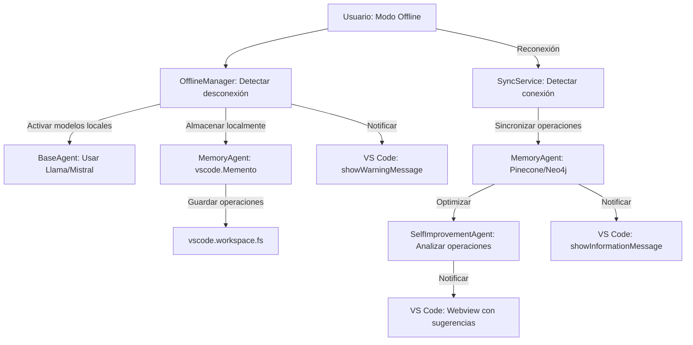

## 📜 CJ.DevMind: Rules (Actualizado)

### Visión General

El documento **CJ.DevMind: Rules** define las reglas, políticas y flujos de decisión que rigen el comportamiento de los **30 agentes especializados** (antes 23), las interacciones entre ellos, y las operaciones del sistema, integrado como una extensión de VS Code con una arquitectura híbrida (cliente ligero en VS Code y servidor backend para tareas pesadas). Estas reglas aseguran que el sistema sea predecible, seguro, y alineado con los objetivos del usuario y el modelo de negocio, mientras se adapta a proyectos de cualquier escala y complejidad (desde una tienda en línea sencilla hasta una app MLM híbrida con realidad aumentada).

#### Objetivos de las Reglas
- Garantizar la **coordinación eficiente** entre agentes mediante un sistema de dependencias claro, gestionado a través del **VSCodeAgentBridge**.
- Asegurar la **seguridad** del sistema mediante políticas de validación, auditoría, y aprobaciones, con almacenamiento seguro en VS Code (`vscode.SecretStorage`).
- Mantener la **persistencia de contexto** y la trazabilidad de las operaciones, tanto en línea como en modo offline.
- Gestionar el **ciclo de vida de tareas** para evitar bloqueos y garantizar completitud, con notificaciones en VS Code.
- Alinear las operaciones con el **modelo de negocio** (licencias, sistema de créditos, marketplace), integrando pagos y compras directamente en VS Code.
- Facilitar la **integración con VS Code**, asegurando que los comandos, webviews, y notificaciones sean consistentes y seguros.
- **(Nuevo)** Incorporar las capacidades de **autoextensión**, **automejora**, **revisión de código**, y **pruebas avanzadas** para optimizar el desarrollo y la calidad del código.

#### Características Clave (Actualizadas)
- **Persistencia de Contexto**: Guardado automático del estado del sistema (tareas, dependencias, métricas, código, decisiones) con checkpoints periódicos (cada 100 operaciones o 10 minutos) en `cjdevmind.db` y en el almacenamiento local de VS Code (`vscode.Memento`, `vscode.workspace.fs`).
- **Ejecución Autónoma Supervisada**: Modo simulación para previsualizar acciones en un webview de VS Code, rollbacks automáticos con puntos de restauración (usando el **GitAdapter**), y logs transaccionales para operaciones críticas.
- **Gestión de Dependencias**: Grafo dinámico gestionado por el **OrchestratorAgent**, con resolución de bloqueos y priorización inteligente basada en una **PriorityQueue**.
- **Ciclo de Vida de Tareas**: Estados (PENDING, IN_PROGRESS, BLOCKED, REVIEW, COMPLETED, ERROR, CANCELLED) gestionados por el **TaskManager**, con transiciones visibles en VS Code mediante notificaciones y vistas de árbol.
- **Dashboard de Supervisión**: Visualización en tiempo real de tareas, agentes, métricas de ROI, sistema de créditos, y gestión de licencias, renderizado en un webview de VS Code.
- **Modelo de Negocio Integrado**: Licencias (Community, Professional, Enterprise), sistema de créditos para desbloquear funcionalidades y comprar extensiones, y un marketplace integrado en VS Code.
- **Soporte para Modo Offline**: Operaciones sin conexión usando modelos locales (Llama, Mistral), almacenamiento local, y sincronización al reconectar.
- **Integración con VS Code**: Los agentes se ejecutan como parte de una extensión de VS Code, con comandos personalizados (`cjdevmind.[agent]`), webviews para el dashboard y el marketplace, y soporte para modo offline.
- **(Nuevo)** **Autoextensión y Automejora**: El **ExtensionAgent** y el **SelfImprovementAgent** permiten la instalación automática de extensiones y la optimización de procesos, respectivamente.
- **(Nuevo)** **Revisión de Código y Pruebas Avanzadas**: El **CodeReviewAgent** y el **TestAgent** aseguran la calidad del código mediante revisiones automáticas y pruebas avanzadas (usabilidad, accesibilidad, integración).

---

## 🔄 Estructura de las Reglas (Visual de Árbol Actualizado)

Las reglas están organizadas jerárquicamente para reflejar las prioridades y dependencias dentro del sistema, ahora incluyendo categorías para los nuevos agentes y funcionalidades.

```
Rules
├── Reglas de Coordinación
│   ├── Gestión de Dependencias
│   │   ├── Resolución de Bloqueos
│   │   └── Priorización de Tareas
│   ├── Ciclo de Vida de Tareas
│   │   ├── Transiciones Permitidas
│   │   ├── Manejo de Errores
│   │   └── Tareas Críticas (REVIEW)
│   └── Comunicación entre Agentes
│       ├── Formato de Mensajes
│       ├── Sistema de Eventos
│       └── Prioridad de Mensajes
├── Reglas de Seguridad
│   ├── Gestión de Credenciales
│   │   ├── Almacenamiento Seguro (VS Code)
│   │   ├── Rotación de Credenciales
│   │   └── Aislamiento de Entornos
│   ├── Validación de Entrada
│   │   ├── Sanitización
│   │   ├── Esquemas de Datos
│   │   └── Prevención de Inyección
│   ├── Auditoría
│   │   ├── Registro de Operaciones
│   │   ├── Trazabilidad
│   │   └── Alertas
│   └── Ejecución Autónoma Supervisada
│       ├── Modo Simulación (Webview)
│       ├── Rollbacks (GitAdapter)
│       └── Aprobaciones Humanas (Notificaciones)
├── Reglas de Persistencia
│   ├── Guardado Automático
│   ├── Checkpoints Periódicos
│   └── Logs Transaccionales
├── Reglas del Modelo de Negocio
│   ├── Licencias
│   │   ├── Community
│   │   ├── Professional
│   │   └── Enterprise
│   ├── Sistema de Créditos
│   │   ├── Compra de Créditos (Stripe)
│   │   ├── Uso de Créditos
│   │   └── Reembolsos
│   └── Marketplace
│       ├── Instalación de Extensiones
│       ├── Publicación de Extensiones
│       └── Seguridad de Extensiones (PluginSandbox)
├── Reglas de Agentes
│   ├── Meta-Nivel
│   ├── Frontend
│   ├── Backend
│   ├── Calidad
│   ├── Infraestructura
│   ├── Documentación
│   ├── Negocio
│   ├── Autoextensión (Nuevo)
│   ├── Automejora (Nuevo)
│   ├── Revisión de Código (Nuevo)
│   ├── Pruebas Avanzadas (Nuevo)
│   └── Otros (VSCodeAgentBridge, ExtensionAgent)
├── Reglas Operacionales
│   ├── Modo Offline
│   │   ├── Almacenamiento Local
│   │   ├── Modelos Locales (Llama, Mistral)
│   │   └── Sincronización
│   ├── Telemetría
│   ├── Dashboard (Webview)
│   └── Ciclo de Desarrollo
└── Reglas de Integración con VS Code
    ├── Comandos (cjdevmind.[agent])
    ├── Webviews (Dashboard, Marketplace)
    ├── Notificaciones
    └── Almacenamiento (vscode.Memento, SecretStorage)
```

---

### Detalle de las Reglas por Categoría (Actualizado)

#### 1. Reglas de Coordinación

Estas reglas aseguran que los agentes trabajen de manera coordinada, evitando bloqueos y garantizando un flujo de trabajo eficiente, ahora con soporte para los nuevos agentes y funcionalidades.

- **Gestión de Dependencias**:
  - **Resolución de Bloqueos**:
    - Si un agente está bloqueado (estado BLOCKED), el **OrchestratorAgent** pausa al agente y reasigna tareas dependientes, notificando al usuario mediante `vscode.window.showInformationMessage`.
    - Ejemplo: Si el **APIAgent** está esperando al **DatabaseAgent**, el **OrchestratorAgent** pausa al **FrontendSyncAgent** y muestra un mensaje en VS Code: "Esperando esquema de base de datos para continuar."
    - Regla: "El OrchestratorAgent debe notificar al usuario si una tarea permanece en BLOCKED por más de 5 minutos."
    - **(Nuevo)** Regla: "El **SelfImprovementAgent** debe analizar bloqueos recurrentes y sugerir optimizaciones al **OrchestratorAgent**, mostrando las sugerencias en un webview de VS Code."
  - **Priorización de Tareas**:
    - Las tareas se priorizan según impacto y licencia del usuario:
      - Alta prioridad: Tareas de **Calidad** (**TestingAgent**, **SecurityAgent**, **CodeReviewAgent**, **TestAgent**) si hay errores, o tareas críticas marcadas por usuarios **Enterprise**.
      - Media prioridad: Tareas de desarrollo (**APIAgent**, **LogicAgent**, **StyleAgent**).
      - Baja prioridad: Tareas de documentación (**DocAgent**) o análisis de negocio (**BusinessAgent**) si no hay dependencias inmediatas.
    - Regla: "Ninguna tarea de baja prioridad puede ejecutarse si hay tareas de alta prioridad en PENDING o IN_PROGRESS, a menos que el usuario tenga licencia Enterprise y haya marcado la tarea como prioritaria."
    - **(Nuevo)** Regla: "El **SelfImprovementAgent** puede ajustar dinámicamente las prioridades basándose en métricas de rendimiento, notificando al usuario mediante `vscode.window.showInformationMessage`."

- **Ciclo de Vida de Tareas**:
  - **Transiciones Permitidas**:
    - PENDING → IN_PROGRESS, CANCELLED
    - IN_PROGRESS → BLOCKED, REVIEW, ERROR, COMPLETED
    - BLOCKED → IN_PROGRESS, CANCELLED
    - REVIEW → COMPLETED, IN_PROGRESS, CANCELLED
    - ERROR → IN_PROGRESS, CANCELLED
    - Regla: "Una tarea no puede pasar de PENDING a COMPLETED directamente; debe pasar por IN_PROGRESS y ser notificada en VS Code."
  - **Manejo de Errores**:
    - Si una tarea entra en ERROR, el **OrchestratorAgent** notifica al **TestingAgent** y al **CodeReviewAgent** para análisis, mostrando un mensaje en VS Code.
    - Regla: "Tras 3 intentos fallidos (ERROR → IN_PROGRESS), la tarea pasa a CANCELLED y se notifica al usuario mediante `vscode.window.showErrorMessage`."
    - **(Nuevo)** Regla: "El **SelfImprovementAgent** debe analizar los errores recurrentes y sugerir mejoras al agente responsable, mostrando las sugerencias en un webview de VS Code."
  - **Tareas Críticas (REVIEW)**:
    - Tareas marcadas como REVIEW requieren aprobación humana, mostrada en un webview de VS Code.
    - Regla: "Tareas de despliegue (**DevOpsAgent**) o integración (**IntegrationAgent**) deben pasar por REVIEW antes de COMPLETED, con una notificación interactiva en VS Code (`vscode.window.showQuickPick` para aprobar/rechazar)."
    - **(Nuevo)** Regla: "El **CodeReviewAgent** debe realizar una revisión automática del código antes de pasar a REVIEW, y el **TestAgent** debe ejecutar pruebas avanzadas (usabilidad, accesibilidad, integración), mostrando los resultados en el webview de aprobación."

- **Comunicación entre Agentes**:
  - **Formato de Mensajes**:
    - Los mensajes deben seguir el formato definido, ahora incluyendo un canal para VS Code y soporte para automejora:
      ```typescript
      interface AgentMessage {
        from: string;       // Agente emisor
        to: string;         // Agente receptor
        type: MessageType;  // Tipo de mensaje (REQUEST, RESPONSE, ERROR, SUGGESTION)
        payload: any;       // Contenido del mensaje
        channel: string;    // Canal temático (frontend, backend, calidad, etc.)
        metadata: {         // Metadatos
          timestamp: number;
          correlationId: string;
          priority: Priority; // HIGH, MEDIUM, LOW
          vscodeContext?: VSCodeContext; // Contexto para notificaciones en VS Code
          improvement?: boolean; // Indica si el mensaje es una sugerencia del SelfImprovementAgent
        };
      }
      ```
    - Regla: "Todos los mensajes deben incluir un correlationId para trazabilidad y un canal temático para enrutamiento."
    - **(Nuevo)** Regla: "Mensajes de tipo SUGGESTION (enviados por el **SelfImprovementAgent**) deben incluir el campo `improvement: true` y ser procesados con prioridad MEDIUM."
  - **Sistema de Eventos**:
    - Los agentes usan el **EventBus** para comunicación asíncrona, con soporte para WebSockets en la arquitectura híbrida.
    - Regla: "Los eventos de alta prioridad (HIGH) deben procesarse antes que los de prioridad baja (LOW), y los eventos dirigidos a VS Code deben incluir un `vscodeContext`."
    - **(Nuevo)** Regla: "El **SelfImprovementAgent** puede emitir eventos de tipo SUGGESTION para optimizar procesos, y estos deben ser procesados por el agente receptor dentro de los 60 segundos."
  - **Prioridad de Mensajes**:
    - Regla: "Mensajes de error (ERROR) tienen prioridad HIGH y deben procesarse inmediatamente, con una notificación en VS Code (`vscode.window.showErrorMessage`)."
    - **(Nuevo)** Regla: "Mensajes de tipo SUGGESTION tienen prioridad MEDIUM y deben ser mostrados al usuario en un webview de VS Code si no son procesados automáticamente."

#### 2. Reglas de Seguridad

Estas reglas protegen el sistema contra vulnerabilidades y aseguran operaciones seguras, ahora con integración de los nuevos agentes.

- **Gestión de Credenciales**:
  - **Almacenamiento Seguro (VS Code)**:
    - Las claves API se almacenan encriptadas en `vscode.SecretStorage`.
    - Regla: "Ningún agente puede acceder directamente a claves API sin pasar por el **SecurityAgent**, que usa `vscode.SecretStorage` para recuperarlas."
  - **Rotación de Credenciales**:
    - Las credenciales se rotan cada 90 días, con una notificación en VS Code.
    - Regla: "El **SecurityAgent** debe notificar al usuario 7 días antes de la rotación mediante `vscode.window.showWarningMessage`."
  - **Aislamiento de Entornos**:
    - Los entornos de desarrollo, staging, y producción están aislados, con configuraciones separadas en VS Code.
    - Regla: "Ningún agente puede acceder a datos de producción desde un entorno de desarrollo sin autorización, verificada mediante `vscode.workspace.getConfiguration`."

- **Validación de Entrada**:
  - **Sanitización**:
    - Todas las entradas del usuario (por ejemplo, en el cuestionario del **QuestionAgent**) se sanitizan para prevenir XSS, SQL injection, etc.
    - Regla: "El **SecurityAgent** debe sanitizar todas las entradas antes de pasarlas a otros agentes, usando `SecurityUtils.sanitizeInput`."
  - **Esquemas de Datos**:
    - Los datos estructurados (JSON, formularios) deben validarse contra esquemas predefinidos.
    - Regla: "El **APIAgent** debe rechazar solicitudes que no cumplan con el esquema de entrada, notificando al usuario en VS Code."
  - **Prevención de Inyección**:
    - Regla: "El **SecurityAgent** debe bloquear prompts que contengan patrones de inyección (por ejemplo, 'system:') antes de enviarlos al LLM, y registrar el intento en el **MemoryAgent**."
    - **(Nuevo)** Regla: "El **SelfImprovementAgent** debe analizar patrones de inyección detectados y sugerir mejoras al **SecurityAgent**, mostrando las sugerencias en un webview de VS Code."

- **Auditoría**:
  - **Registro de Operaciones**:
    - Todas las operaciones se registran en logs transaccionales, almacenados en `cjdevmind.db` y en el **MemoryAgent**.
    - Regla: "Cada operación debe incluir un timestamp, agente emisor, correlationId, y canal temático."
  - **Trazabilidad**:
    - Las decisiones de los agentes deben ser trazables a través del **MemoryAgent**, con soporte para modo offline.
    - Regla: "El **OrchestratorAgent** debe guardar el historial de decisiones en el **MemoryAgent**, incluso en modo offline usando Faiss."
  - **Alertas**:
    - Se generan alertas para actividades sospechosas, mostradas en VS Code.
    - Regla: "El **MonitorAgent** debe enviar una alerta mediante `vscode.window.showErrorMessage` si un agente falla 5 veces consecutivas."
    - **(Nuevo)** Regla: "El **SelfImprovementAgent** debe analizar las alertas generadas y sugerir optimizaciones al agente responsable, mostrando las sugerencias en un webview de VS Code."

- **Ejecución Autónoma Supervisada**:
  - **Modo Simulación (Webview)**:
    - Los agentes pueden previsualizar acciones en un webview de VS Code.
    - Regla: "El comando `cjdevmind.simulate` debe ejecutarse antes de cualquier operación crítica (despliegue, integración), mostrando una previsualización en un webview."
  - **Rollbacks (GitAdapter)**:
    - Se crean puntos de restauración antes de operaciones críticas usando el **GitAdapter**.
    - Regla: "El **DevOpsAgent** debe crear un rollback antes de cada despliegue, con un commit en Git (`Pre-deployment: [taskId]`)."
  - **Aprobaciones Humanas (Notificaciones)**:
    - Regla: "Tareas en estado REVIEW deben esperar aprobación humana mediante una notificación interactiva en VS Code (`vscode.window.showQuickPick` para aprobar/rechazar)."
    - **(Nuevo)** Regla: "El **CodeReviewAgent** y el **TestAgent** deben proporcionar un informe detallado (revisión de código y resultados de pruebas) en el webview de aprobación para tareas en estado REVIEW."

#### 3. Reglas de Persistencia

Estas reglas aseguran que el estado del sistema sea persistente y recuperable, ahora con soporte para modo offline y almacenamiento en VS Code.

- **Guardado Automático**:
  - El **MemoryAgent** guarda el estado tras cada cambio significativo, tanto en `cjdevmind.db` como en el almacenamiento local de VS Code.
  - Regla: "Cada operación que modifique el grafo de dependencias debe guardarse inmediatamente en `cjdevmind.db` y en `vscode.Memento` si está offline."
- **Checkpoints Periódicos**:
  - Checkpoints cada 100 operaciones o 10 minutos, sincronizados al reconectar en modo offline.
  - Regla: "El **MemoryAgent** debe crear un checkpoint si han pasado más de 10 minutos desde el último, o al reconectar después de estar offline."
- **Logs Transaccionales**:
  - Los logs permiten reconstruir el estado del sistema, almacenados en `cjdevmind.db` y en el **MemoryAgent**.
  - Regla: "Cada log transaccional debe incluir el estado de la tarea antes y después de la operación, con un correlationId para trazabilidad."
  - **(Nuevo)** Regla: "El **SelfImprovementAgent** debe analizar los logs transaccionales para identificar patrones de ineficiencia y sugerir optimizaciones, mostrando las sugerencias en un webview de VS Code."

#### 4. Reglas del Modelo de Negocio

Estas reglas alinean el sistema con el modelo de negocio, ahora integrado en VS Code y con soporte para los nuevos agentes.

- **Licencias**:
  - **Community**:
    - Acceso limitado a 10 agentes activos simultáneamente (Meta-Nivel, Documentación, algunos de Frontend y Backend).
    - Regla: "Usuarios Community no pueden usar agentes de **Infraestructura** (**DevOpsAgent**, **DashboardAgent**), **Negocio** (**BusinessAgent**, **LaunchAgent**, **MarketAgent**), **Autoextensión** (**ExtensionAgent**), **Automejora** (**SelfImprovementAgent**), **Revisión de Código** (**CodeReviewAgent**), ni **Pruebas Avanzadas** (**TestAgent**), y se les notifica en VS Code para actualizar su licencia."
  - **Professional**:
    - Acceso a todos los agentes, limitado a 5 proyectos simultáneos.
    - Regla: "Usuarios Professional deben comprar créditos para proyectos adicionales, con un formulario de pago en un webview de VS Code."
  - **Enterprise**:
    - Acceso ilimitado, soporte prioritario, y personalización.
    - Regla: "Usuarios Enterprise tienen prioridad HIGH en el soporte del Marketplace y en la priorización de tareas."

- **Sistema de Créditos**:
  - **Compra de Créditos (Stripe)**:
    - Los créditos se compran a través del **PaymentService**, con un formulario de pago en un webview de VS Code.
    - Regla: "Cada transacción de compra debe generar una factura a través del **InvoiceService**, y el saldo se actualiza en `vscode.workspace.getConfiguration`."
  - **Uso de Créditos**:
    - 50 créditos por extensión del Marketplace, 20 créditos por proyecto adicional (Professional), 10 créditos por ejecución de pruebas avanzadas (**TestAgent**).
    - Regla: "El **ExtensionAgent** y el **TestAgent** deben verificar el saldo de créditos antes de realizar acciones que consuman créditos, mostrando un mensaje en VS Code si el saldo es insuficiente."
  - **Reembolsos**:
    - Los reembolsos se procesan si una extensión falla, con notificación en VS Code.
    - Regla: "El **PaymentService** debe procesar reembolsos dentro de las 48 horas posteriores a la solicitud, notificando al usuario mediante `vscode.window.showInformationMessage`."

- **Marketplace**:
  - **Instalación de Extensiones**:
    - Las extensiones deben pasar un escaneo de seguridad antes de instalarse.
    - Regla: "El **SecurityScanner** debe aprobar una extensión antes de su instalación, y el **PluginSandbox** debe aislar su ejecución."
    - **(Nuevo)** Regla: "El **ExtensionAgent** puede instalar extensiones automáticamente (autoextensión) si el usuario lo solicita, verificando primero el saldo de créditos y la seguridad de la extensión."
  - **Publicación de Extensiones**:
    - Las extensiones publicadas requieren revisión por parte del equipo de CJ.DevMind.
    - Regla: "El **MarketplaceAPI** debe añadir extensiones a una cola de revisión antes de publicarlas, notificando al desarrollador en VS Code."
  - **Seguridad de Extensiones (PluginSandbox)**:
    - Regla: "El **PluginSandbox** debe aislar las extensiones para prevenir acceso no autorizado al sistema, y cualquier fallo debe desactivar la extensión automáticamente."
    - **(Nuevo)** Regla: "El **SelfImprovementAgent** debe analizar los fallos de extensiones y sugerir mejoras al desarrollador, mostrando las sugerencias en un webview de VS Code."

#### 5. Reglas de Agentes

Estas reglas definen el comportamiento específico de cada categoría de agentes, ahora incluyendo las nuevas categorías.

- **Meta-Nivel**:
  - Regla: "El **QuestionAgent** debe descomponer requerimientos en al menos 2 tareas accionables, mostrando un cuestionario interactivo en VS Code (`vscode.window.showInputBox`)."
  - Regla: "El **OrchestratorAgent** debe reasignar tareas si un agente está en ERROR más de 3 veces, notificando al usuario en VS Code."
  - **(Nuevo)** Regla: "El **SelfImprovementAgent** debe optimizar los cuestionarios del **QuestionAgent** si detecta redundancias, mostrando las mejoras en un webview de VS Code."

- **Frontend**:
  - Regla: "El **UIDesignAgent** debe generar diseños accesibles (WCAG 2.1) antes de pasarlos al **LayoutAgent**, con una previsualización en un webview de VS Code."
  - Regla: "El **FrontendSyncAgent** debe esperar a que el **APIAgent** complete los endpoints antes de conectar, mostrando un mensaje de espera en VS Code."
  - **(Nuevo)** Regla: "El **StyleAgent** debe aplicar estilos consistentes (CSS, Tailwind, etc.) a los diseños generados por el **UIDesignAgent**, asegurando que cumplan con las guías de estilo del proyecto, y pasar el código al **CodeReviewAgent** para revisión."

- **Backend**:
  - Regla: "El **APIAgent** debe incluir validaciones de entrada en todos los endpoints generados, usando esquemas predefinidos."
  - Regla: "El **DatabaseAgent** debe crear índices para todas las tablas con más de 10,000 registros, y guardar el esquema en el **MemoryAgent**."
  - **(Nuevo)** Regla: "El **CodeReviewAgent** debe revisar el código generado por el **APIAgent** y el **DatabaseAgent**, asegurando que cumpla con las mejores prácticas (por ejemplo, DRY, SOLID), y mostrar los resultados en un webview de VS Code."

- **Calidad**:
  - Regla: "El **TestingAgent** debe alcanzar un 80% de cobertura de pruebas antes de pasar una tarea a COMPLETED, con resultados mostrados en VS Code."
  - Regla: "El **SecurityAgent** debe bloquear cualquier endpoint sin autenticación (JWT, OAuth), notificando al usuario en VS Code."
  - **(Nuevo)** Regla: "El **CodeReviewAgent** debe revisar el código generado por todos los agentes, identificando problemas de calidad (por ejemplo, complejidad ciclomática alta) y sugiriendo mejoras, con un informe en un webview de VS Code."
  - **(Nuevo)** Regla: "El **TestAgent** debe ejecutar pruebas avanzadas (usabilidad, accesibilidad, integración) para todos los componentes generados, mostrando los resultados en un webview de VS Code y notificando al usuario si se detectan fallos."

- **Infraestructura**:
  - Regla: "El **DevOpsAgent** debe configurar CI/CD para todos los proyectos con más de 5 commits semanales, usando GitHub Actions o Jenkins."
  - Regla: "El **MonitorAgent** debe generar alertas si el tiempo de respuesta de un endpoint supera los 500ms, mostradas en VS Code."
  - **(Nuevo)** Regla: "El **SelfImprovementAgent** debe analizar las métricas del **MonitorAgent** y sugerir optimizaciones (por ejemplo, caching, compresión), mostrando las sugerencias en un webview de VS Code."

- **Documentación**:
  - Regla: "El **DocAgent** debe generar documentación en Markdown para cada endpoint creado por el **APIAgent**, escribiendo archivos en `docs/` mediante `vscode.workspace.fs`."
  - Regla: "El **MemoryAgent** debe indexar todas las tareas completadas para búsqueda semántica, usando Pinecone en línea y Faiss offline."
  - **(Nuevo)** Regla: "El **SelfImprovementAgent** debe optimizar la documentación generada por el **DocAgent**, eliminando redundancias y mejorando la claridad, con un informe de cambios en un webview de VS Code."

- **Negocio**:
  - Regla: "El **BusinessAgent** debe calcular el ROI de cada proyecto, pero solo está disponible para usuarios Professional y Enterprise."
  - Regla: "El **LaunchAgent** debe planificar lanzamientos basados en tendencias del **MarketAgent**, con planes mostrados en un webview de VS Code."
  - **(Nuevo)** Regla: "El **MarketAgent** debe analizar tendencias del mercado para sugerir nuevas funcionalidades, coordinando con el **SelfImprovementAgent** para optimizar las sugerencias, y mostrando los resultados en un webview de VS Code."
  - **(Nuevo)** Regla: "El **GrowthAgent** debe proponer estrategias de crecimiento (por ejemplo, SEO, campañas de marketing) basadas en los datos del **MarketAgent**, con un plan detallado en un webview de VS Code."
  - **(Nuevo)** Regla: "El **AnalyticsAgent** debe generar métricas detalladas de uso del sistema (por ejemplo, uso de tokens por agente), mostrando los resultados en el dashboard de VS Code."

- **Autoextensión (Nuevo)**:
  - Regla: "El **ExtensionAgent** debe instalar extensiones automáticamente si el usuario lo solicita, verificando primero el saldo de créditos y la seguridad de la extensión mediante el **SecurityScanner**."
  - Regla: "El **ExtensionAgent** debe coordinar con el **SelfImprovementAgent** para optimizar la configuración de las extensiones instaladas, mostrando las optimizaciones en un webview de VS Code."

- **Automejora (Nuevo)**:
  - Regla: "El **SelfImprovementAgent** debe analizar el rendimiento de todos los agentes y sugerir optimizaciones (por ejemplo, reducción de tokens, mejora de prompts), mostrando las sugerencias en un webview de VS Code."
  - Regla: "El **SelfImprovementAgent** debe coordinar con el **OrchestratorAgent** para implementar optimizaciones aprobadas por el usuario, notificando los cambios mediante `vscode.window.showInformationMessage`."

- **Revisión de Código (Nuevo)**:
  - Regla: "El **CodeReviewAgent** debe revisar el código generado por todos los agentes, identificando problemas de calidad (por ejemplo, complejidad ciclomática alta, código duplicado) y sugiriendo mejoras, con un informe en un webview de VS Code."
  - Regla: "El **CodeReviewAgent** debe coordinar con el **SelfImprovementAgent** para implementar mejoras automáticas si el usuario lo aprueba, mostrando los cambios en un webview de VS Code."

- **Pruebas Avanzadas (Nuevo)**:
  - Regla: "El **TestAgent** debe ejecutar pruebas avanzadas (usabilidad, accesibilidad, integración) para todos los componentes generados, mostrando los resultados en un webview de VS Code."
  - Regla: "El **TestAgent** debe coordinar con el **SelfImprovementAgent** para optimizar las pruebas (por ejemplo, reducir falsos positivos), mostrando las optimizaciones en un webview de VS Code."

- **Otros (VSCodeAgentBridge, ExtensionAgent)**:
  - Regla: "El **VSCodeAgentBridge** debe registrar comandos para cada agente (`cjdevmind.[agent]`), asegurando que las ejecuciones sean seguras y trazables."
  - Regla: "El **ExtensionAgent** debe verificar la licencia del usuario antes de instalar extensiones, mostrando un mensaje en VS Code si la licencia no lo permite."

#### 6. Reglas Operacionales

Estas reglas rigen las operaciones generales del sistema, ahora con soporte para los nuevos agentes.

- **Modo Offline**:
  - **Almacenamiento Local**:
    - Regla: "El **OfflineManager** debe almacenar todas las operaciones en `vscode.Memento` y `vscode.workspace.fs` mientras está offline."
  - **Modelos Locales (Llama, Mistral)**:
    - Regla: "El **BaseAgent** debe usar modelos locales (Llama, Mistral) para operaciones de LLM en modo offline, con un límite de 500 tokens por prompt."
  - **Sincronización**:
    - Regla: "El **SyncService** debe sincronizar operaciones en orden de prioridad (alta a baja) al reconectarse, notificando al usuario en VS Code."
    - **(Nuevo)** Regla: "El **SelfImprovementAgent** debe analizar las operaciones sincronizadas y sugerir optimizaciones para futuras operaciones offline, mostrando las sugerencias en un webview de VS Code."

- **Telemetría**:
  - Regla: "El **MonitorAgent** debe registrar métricas de uso de CPU cada 5 minutos, almacenándolas en el **MemoryAgent**."
  - Regla: "El **AnalyticsAgent** debe calcular el ROI de cada proyecto completado, mostrando resultados en el dashboard de VS Code."
  - **(Nuevo)** Regla: "El **SelfImprovementAgent** debe analizar las métricas del **MonitorAgent** y el **AnalyticsAgent**, sugiriendo optimizaciones (por ejemplo, reducción de uso de CPU), con un informe en un webview de VS Code."

- **Dashboard (Webview)**:
  - Regla: "El **DashboardAgent** debe actualizar el estado de las tareas cada 30 segundos en un webview de VS Code."
  - Regla: "El dashboard debe mostrar el saldo de créditos, el plan de licencia del usuario, y un botón para recargar créditos mediante Stripe."
  - **(Nuevo)** Regla: "El dashboard debe incluir métricas de calidad (cobertura de pruebas, resultados de revisión de código) proporcionadas por el **CodeReviewAgent** y el **TestAgent**, actualizadas cada 30 segundos."

- **Ciclo de Desarrollo**:
  - Regla: "Cada iteración del ciclo debe generar un reporte de métricas (AnalyticsAgent), mostrado en un webview de VS Code."
  - **(Nuevo)** Regla: "El **CodeReviewAgent** y el **TestAgent** deben participar en cada iteración del ciclo, asegurando que el código cumpla con los estándares de calidad antes de pasar a la siguiente etapa, con resultados mostrados en un webview de VS Code."

#### 7. Reglas de Integración con VS Code

Estas reglas aseguran una integración segura y eficiente con VS Code.

- **Comandos (cjdevmind.[agent])**:
  - Regla: "El **VSCodeAgentBridge** debe registrar comandos para cada agente (`cjdevmind.[agent]`), asegurando que solo usuarios con la licencia adecuada puedan ejecutarlos."
  - **(Nuevo)** Regla: "Se deben registrar nuevos comandos para los agentes **StyleAgent**, **CodeReviewAgent**, **SelfImprovementAgent**, y **TestAgent** (`cjdevmind.style`, `cjdevmind.codereview`, `cjdevmind.improve`, `cjdevmind.test`), con las mismas restricciones de licencia."

- **Webviews (Dashboard, Marketplace)**:
  - Regla: "Los webviews deben ser seguros, usando `enableScripts: true` solo para scripts aprobados (por ejemplo, Stripe.js), y deben sanitizar todas las entradas del usuario."
  - **(Nuevo)** Regla: "Los webviews deben incluir secciones para mostrar sugerencias del **SelfImprovementAgent**, resultados de revisión del **CodeReviewAgent**, y resultados de pruebas del **TestAgent**, con opciones interactivas para aprobar o rechazar acciones."

- **Notificaciones**:
  - Regla: "Las notificaciones deben usar `vscode.window.showInformationMessage`, `showWarningMessage`, o `showErrorMessage` según la severidad, con un máximo de 3 notificaciones por minuto para evitar spam."
  - **(Nuevo)** Regla: "Las notificaciones deben incluir un enlace a un webview con más detalles si la acción involucra al **SelfImprovementAgent**, **CodeReviewAgent**, o **TestAgent**."

- **Almacenamiento (vscode.Memento, SecretStorage)**:
  - Regla: "El **MemoryAgent** debe usar `vscode.Memento` para datos pequeños (preferencias, saldo de créditos) y `vscode.SecretStorage` para claves API, asegurando que los datos sean persistentes entre sesiones."

---

## 📊 Diagramas de Relación (Actualizados)

### Diagrama 1: Flujo de Decisión para el Ciclo de Vida de Tareas (Actualizado)

Este diagrama muestra cómo se aplican las reglas al ciclo de vida de una tarea, ahora con los nuevos agentes.

```mermaid
graph TD
    A[Tarea: PENDING] -->|Inicia| B[Tarea: IN_PROGRESS]
    B -->|Error detectado| C[Tarea: ERROR]
    C -->|Reintentos < 3| D[OrchestratorAgent: Reintentar]
    D -->|Retraso exponencial| B
    C -->|Reintentos >= 3| E[Tarea: CANCELLED]
    E -->|Notificar| F[VS Code: showErrorMessage]
    B -->|Requiere aprobación| G[Tarea: REVIEW]
    G -->|Revisión automática| H[CodeReviewAgent: Revisar código]
    H -->|Pruebas avanzadas| I[TestAgent: Ejecutar pruebas]
    I -->|Aprobada (VS Code: showQuickPick)| J[Tarea: COMPLETED]
    G -->|Rechazada| B
    B -->|Dependencia no resuelta| K[Tarea: BLOCKED]
    K -->|Notificar| L[VS Code: showInformationMessage]
    K -->|Dependencia resuelta| B
    K -->|Cancelada| E
    J -->|Indexar| M[MemoryAgent]
    J -->|Actualizar| N[DashboardAgent: Webview]
    B -->|Optimización| O[SelfImprovementAgent: Sugerir mejoras]
    O -->|Notificar| P[VS Code: Webview con sugerencias]
```

### Diagrama 2: Flujo de Seguridad para Extensiones (Actualizado)

Este diagrama muestra cómo se aplican las reglas de seguridad al instalar una extensión, ahora con autoextensión y automejora.

```mermaid
graph TD
    A[Usuario: Instalar extensión] --> B[VSCodeAgentBridge: cjdevmind.extension]
    B -->|Ejecutar| C[ExtensionAgent]
    C -->|Autoextensión| D[Verificar solicitud automática]
    D -->|Verificar saldo| E[PaymentService]
    E -->|Saldo suficiente| F[MarketplaceAPI]
    F -->|Escanear seguridad| G[SecurityScanner]
    G -->|Aprobada| H[PluginSandbox]
    H -->|Instalar| I[Éxito: Extensión instalada]
    I -->|Optimizar| J[SelfImprovementAgent: Optimizar configuración]
    J -->|Notificar| K[VS Code: showInformationMessage]
    G -->|Rechazada| L[Error: Seguridad fallida]
    E -->|Saldo insuficiente| M[Error: Créditos insuficientes]
    L -->|Notificar| N[VS Code: showErrorMessage]
    M -->|Notificar| N
    M -->|Ofrecer recarga| O[Webview: Formulario de Pago (Stripe)]
```

### Diagrama 3: Flujo de Modo Offline (Actualizado)

Este diagrama muestra cómo se aplican las reglas en modo offline, ahora con automejora.



### Instrucciones para Renderizar
- Copia el código Mermaid y pégalo en un entorno compatible (GitHub Markdown, Mermaid Live Editor).

---

### Implementación Técnica (Actualizada)

#### Gestión de Reglas

- Las reglas se implementan como políticas en el **OrchestratorAgent**, ahora con soporte para los nuevos agentes y notificaciones en VS Code.
- **Ejemplo: Validación de Transiciones con Nuevos Agentes**:
  ```typescript
  class TaskManager {
    private tasks: Map<string, Task>;
    private transitions: Map<TaskState, TaskState[]> = new Map([
      ['PENDING', ['IN_PROGRESS', 'CANCELLED']],
      ['IN_PROGRESS', ['BLOCKED', 'REVIEW', 'ERROR', 'COMPLETED']],
      ['BLOCKED', ['IN_PROGRESS', 'CANCELLED']],
      ['REVIEW', ['COMPLETED', 'IN_PROGRESS', 'CANCELLED']],
      ['ERROR', ['IN_PROGRESS', 'CANCELLED']]
    ]);

    async transition(taskId: string, newState: TaskState): Promise<void> {
      const task = this.tasks.get(taskId);
      if (!task) throw new Error('Task not found');
      const allowedTransitions = this.transitions.get(task.state);
      if (!allowedTransitions || !allowedTransitions.includes(newState)) {
        throw new Error(`Invalid transition from ${task.state} to ${newState}`);
      }

      // Revisión de código y pruebas avanzadas antes de pasar a REVIEW
      if (newState === 'REVIEW') {
        const codeReviewAgent = AgentFactory.create('CodeReviewAgent', { taskId });
        const testAgent = AgentFactory.create('TestAgent', { taskId });
        const reviewResult = await codeReviewAgent.reviewCode(task.code);
        const testResult = await testAgent.runAdvancedTests(task.code);
        if (!reviewResult.isApproved || !testResult.isPassed) {
          await vscode.window.showErrorMessage(`Task ${taskId} failed review or tests.`);
          task.state = 'IN_PROGRESS';
          return;
        }
      }

      task.state = newState;
      this.tasks.set(taskId, task);
      await this.logTransition(taskId, task.state, newState);

      // Notificar al usuario en VS Code
      if (newState === 'BLOCKED') {
        await vscode.window.showInformationMessage(`Task ${taskId} is BLOCKED: Waiting for dependencies.`);
      } else if (newState === 'ERROR') {
        await vscode.window.showErrorMessage(`Task ${taskId} failed: ${task.errorMessage}`);
      } else if (newState === 'COMPLETED') {
        await vscode.window.showInformationMessage(`Task ${taskId} completed successfully.`);
      }

      // Automejora
      const selfImprovementAgent = AgentFactory.create('SelfImprovementAgent', { taskId });
      const suggestions = await selfImprovementAgent.analyzeTask(task);
      if (suggestions.length > 0) {
        const panel = vscode.window.createWebviewPanel(
          'improvementSuggestions',
          'Improvement Suggestions',
          vscode.ViewColumn.One,
          {}
        );
        panel.webview.html = `<html><body><h1>Suggestions</h1><pre>${JSON.stringify(suggestions, null, 2)}</pre></body></html>`;
      }
    }

    private async logTransition(taskId: string, oldState: TaskState, newState: TaskState): Promise<void> {
      const log = {
        taskId,
        oldState,
        newState,
        timestamp: Date.now(),
        correlationId: generateId()
      };
      await this.memory.store(log, { type: 'transition' });
    }
  }
  ```

#### Seguridad de Extensiones

- **Ejemplo: Escaneo de Seguridad con Autoextensión y Automejora**:
  ```typescript
  class SecurityScanner {
    async scan(plugin: PluginSubmission): Promise<SecurityResult> {
      const checks = [
        this.checkForMaliciousCode(plugin),
        this.checkForUnauthorizedAccess(plugin),
        this.checkForVulnerabilities(plugin)
      ];
      const results = await Promise.all(checks);
      const isSafe = results.every(result => result);
      if (!isSafe) {
        await vscode.window.showErrorMessage(`Plugin ${plugin.name} failed security scan.`);
      } else {
        const selfImprovementAgent = AgentFactory.create('SelfImprovementAgent', { pluginId: plugin.id });
        const suggestions = await selfImprovementAgent.analyzePlugin(plugin);
        if (suggestions.length > 0) {
          const panel = vscode.window.createWebviewPanel(
            'pluginSuggestions',
            'Plugin Improvement Suggestions',
            vscode.ViewColumn.One,
            {}
          );
          panel.webview.html = `<html><body><h1>Suggestions for ${plugin.name}</h1><pre>${JSON.stringify(suggestions, null, 2)}</pre></body></html>`;
        }
      }
      return {
        isSafe,
        details: results
      };
    }

    private async checkForMaliciousCode(plugin: PluginSubmission): Promise<boolean> {
      const patterns = [/eval\(/, /exec\(/, /system\(/];
      return !patterns.some(pattern => plugin.code.match(pattern));
    }

    private async checkForUnauthorizedAccess(plugin: PluginSubmission): Promise<boolean> {
      return !plugin.code.includes('process.env');
    }

    private async checkForVulnerabilities(plugin: PluginSubmission): Promise<boolean> {
      // Simulación de escaneo de vulnerabilidades
      return true;
    }
  }
  ```

#### Persistencia con Modo Offline

- **Ejemplo: Checkpoints y Sincronización con Automejora**:
  ```typescript
  class MemoryAgent {
    private lastCheckpoint: number = Date.now();
    private offlineQueue: Operation[] = [];

    async store(data: any, metadata: any): Promise<void> {
      if (this.isOffline()) {
        this.offlineQueue.push({ data, metadata });
        await this.storeLocally(data, metadata);
      } else {
        await this.memoryService.store(data, metadata);
      }
      await this.checkpointIfNeeded();
    }

    private async storeLocally(data: any, metadata: any): Promise<void> {
      const key = `memory-${metadata.type}-${Date.now()}`;
      await vscode.workspace.getConfiguration().update(key, JSON.stringify({ data, metadata }), true);
    }

    private async checkpointIfNeeded(): Promise<void> {
      const now = Date.now();
      if (now - this.lastCheckpoint >= 10 * 60 * 1000) { // 10 minutos
        if (this.isOffline()) {
          await this.storeLocally({ checkpoint: true }, { type: 'checkpoint' });
        } else {
          await this.memoryService.createCheckpoint();
        }
        this.lastCheckpoint = now;
      }
    }

    async syncOnReconnect(): Promise<void> {
      for (const operation of this.offlineQueue) {
        await this.memoryService.store(operation.data, operation.metadata);
      }
      this.offlineQueue = [];
      await vscode.window.showInformationMessage('Offline operations synchronized successfully.');

      // Automejora
      const selfImprovementAgent = AgentFactory.create('SelfImprovementAgent', {});
      const suggestions = await selfImprovementAgent.analyzeOfflineOperations(this.offlineQueue);
      if (suggestions.length > 0) {
        const panel = vscode.window.createWebviewPanel(
          'offlineSuggestions',
          'Offline Operation Suggestions',
          vscode.ViewColumn.One,
          {}
        );
        panel.webview.html = `<html><body><h1>Offline Suggestions</h1><pre>${JSON.stringify(suggestions, null, 2)}</pre></body></html>`;
      }
    }

    private isOffline(): boolean {
      return !navigator.onLine; // Simulación de detección de conexión
    }
  }
  ```

---

### Ejemplo de Flujo Completo (Actualizado)

**Escenario**: Desarrollar un componente frontend con estilos, revisión de código, pruebas avanzadas, y optimización automática.

1. **Usuario**: Ejecuta `cjdevmind.ui design product-viewer` en VS Code.
2. **VSCodeAgentBridge**: Inicia el **UIDesignAgent**.
3. **UIDesignAgent**:
   - Genera un diseño accesible (WCAG 2.1) para el visor de productos.
   - Regla: "El **UIDesignAgent** debe generar diseños accesibles antes de pasarlos al **LayoutAgent**."
   - Pasa el diseño al **LayoutAgent**.
4. **LayoutAgent**:
   - Convierte el diseño en código HTML/CSS.
   - Pasa el código al **StyleAgent**.
5. **StyleAgent**:
   - Aplica estilos consistentes (por ejemplo, Tailwind CSS) al componente.
   - Regla: "El **StyleAgent** debe aplicar estilos consistentes y pasar el código al **CodeReviewAgent**."
   - Pasa el código al **CodeReviewAgent**.
6. **CodeReviewAgent**:
   - Revisa el código, identificando problemas (por ejemplo, CSS redundante).
   - Regla: "El **CodeReviewAgent** debe revisar el código generado, identificando problemas de calidad."
   - Genera un informe y lo muestra en un webview de VS Code.
7. **TestAgent**:
   - Ejecuta pruebas avanzadas (usabilidad, accesibilidad, integración) en el componente.
   - Regla: "El **TestAgent** debe ejecutar pruebas avanzadas y mostrar los resultados en un webview de VS Code."
   - Pasa si las pruebas son exitosas; de lo contrario, notifica al usuario mediante `vscode.window.showErrorMessage`.
8. **SelfImprovementAgent**:
   - Analiza el código, las pruebas, y el proceso general.
   - Regla: "El **SelfImprovementAgent** debe analizar el rendimiento y sugerir optimizaciones."
   - Sugiere optimizaciones (por ejemplo, reducir el uso de Tailwind para mejorar el rendimiento) y las muestra en un webview de VS Code.
9. **OrchestratorAgent**:
   - Marca la tarea como COMPLETED si todas las revisiones y pruebas pasan.
   - Regla: "Una tarea no puede pasar a COMPLETED sin pasar por IN_PROGRESS y ser notificada en VS Code."
   - Notifica al usuario: "Componente product-viewer completado exitosamente."
10. **DashboardAgent**:
    - Actualiza el estado (Éxito: Componente creado) y las métricas de calidad (cobertura de pruebas, resultados de revisión) en el webview de VS Code.
    - Regla: "El dashboard debe incluir métricas de calidad proporcionadas por el **CodeReviewAgent** y el **TestAgent**."

**Resultado**:
- El componente `product-viewer` se genera con estilos consistentes, pasa la revisión de código y las pruebas avanzadas, y se optimiza automáticamente. El usuario recibe notificaciones y reportes detallados en VS Code durante todo el proceso.

---

### Resumen Final

El documento **rules.md** ha sido actualizado para incluir los 30 agentes especializados, con nuevas categorías para **Autoextensión**, **Automejora**, **Revisión de Código**, y **Pruebas Avanzadas**. Las reglas han sido ajustadas para reflejar las interacciones entre los nuevos agentes (**StyleAgent**, **CodeReviewAgent**, **SelfImprovementAgent**, **TestAgent**, **MarketAgent**, **GrowthAgent**, **AnalyticsAgent**) y los existentes, asegurando una integración fluida con VS Code. Los diagramas, ejemplos de código, y flujos han sido actualizados para reflejar las nuevas funcionalidades. Si necesitas más ajustes o detalles adicionales, estaré encantado de ayudarte.


